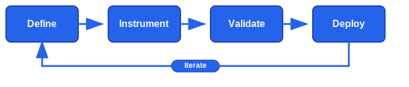
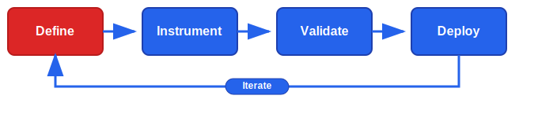
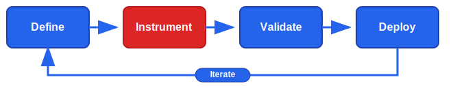
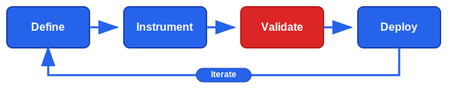
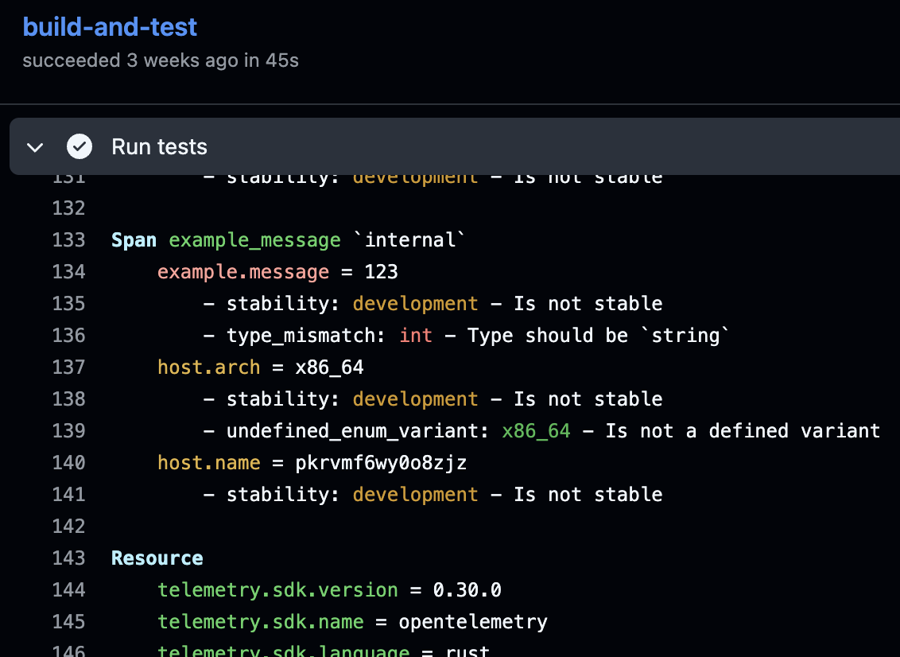
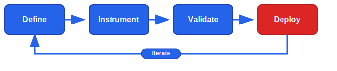

# OpenTelemetry Weaver

<p align="left">
  
</p>

### Observability by Design

_Treat your telemetry like a public API_

&nbsp;

[](https://github.com/open-telemetry/weaver/actions/workflows/ci.yml)
[](https://codecov.io/gh/open-telemetry/weaver)
[](https://github.com/open-telemetry/weaver/actions/workflows/audit.yml)
[](https://opensource.org/licenses/Apache-2.0)
[](https://cloud-native.slack.com/archives/C0697EXNTL3)

## What is Observability by Design?

Have you ever experienced:

- Broken alerts after a deployment because metric names changed?
- Complex, hard-to-understand queries due to inconsistent naming?
- Teams struggling to interpret unclear or undocumented signals?
- Missing critical instrumentation discovered only in production?

**Observability by Design** solves these problems by treating your observability signals (metrics, traces, logs) as a first-class public API that requires the same quality standards as your code.

## The Observability by Design Workflow



1. **Define**: Set clear observability objectives early
2. **Instrument**: Generate type-safe code and docs
3. **Validate**: Catch issues in CI/CD pipeline
4. **Deploy**: Ship with confidence
5. **Iterate**: Refine using production feedback

## Real-World Impact

**Before Weaver:**

```rust
// Developer A:
counter.add(1, [("method", "GET")]);

// Developer B:
counter.add(1, [("http_method", "GET")]);
// Result: Inconsistent data, broken dashboards
```

**With Weaver:**

```rust
// Both developers:
counter.add(1, [(attributes::HttpMethod::KEY, "GET")]);
// Result: Consistent data, reliable observability
```

## Install

**Pre-built binaries:**

Linux, Windows and Mac installers on the [releases](https://github.com/open-telemetry/weaver/releases) page.

**Docker:**

```bash
docker pull otel/weaver
```

**From source:**

```bash
git clone https://github.com/open-telemetry/weaver.git
cd weaver
cargo build --release
```

## Define Your Schema



Weaver leverages the [OpenTelemetry Semantic Conventions](https://opentelemetry.io/docs/specs/semconv/) - 900+ standardized attributes across 74 domains, maintained by expert groups.

Use official conventions, extend them, or create custom registries for your needs.

Create `my-app.yaml`:

```yaml
groups:
  - id: span.example_message
    type: span
    stability: development
    brief: This span represents a simple message.
    span_kind: client
    attributes:
      - ref: example.message
        requirement_level: required
      - ref: host.name
        requirement_level: required
      - ref: host.arch
        requirement_level: required
```

## Generate Type-Safe Code and Docs



- **Resolution and Validation**
- **Flexible data processing**
- **Customizable Templates**
- **Predefined Markdown templates available**

```bash
# Generate Rust client
weaver registry generate -r ./my-app.yaml -t templates rust

# Generate documentation
weaver registry generate -r ./my-app.yaml -t templates markdown
```

```rust
let http_request_duration = HttpServerRequestDuration::<u64>::new(&meter);
// Records a new data point and provides the required and some optional attributes
http_request_duration.record(
    100,
    &HttpServerRequestDurationReqAttributes {
        http_request_method: HttpRequestMethod::Connect,
        url_scheme: "http".to_owned(),
    },
    Some(&HttpServerRequestDurationOptAttributes {
        http_response_status_code: Some(200),
        ..Default::default()
    }),
);
```

## Validate definitions and live telemetry



### Policy-based Static Validation Check

Prevent breaking changes and enforce standards:

- **Verify best practices compliance**
- **Validate schema changes (avoid breaking alerts, dashboards, ...)**

```bash
weaver registry check --policy policies/
```

```
Violation: Metric 'auction.bid.count' cannot change
required/recommended attributes (missing '{"auction.
id"}')
- Category        : backward_compatibility
- Type           : semconv_attribute
- SemConv group  : metric.auction.bid.count
- SemConv attribute: auction.id
- Provenance: /home/weaver/source

Total execution time: 5.531342577s
make: *** [Makefile:89: check] Error 1
```

### Live Instrumentation Checks

Check running apps against your schema:

- **Confirm captured OTLP telemetry matches registry**
- **Check coverage against registry**
- **Check compliance with custom policies**

```bash
weaver registry live-check --registry ./my-registry
```

**Test the actual OTLP from your app in CI/CD**



### Publish Definitions



**Coming soon**

- **Share your telemetry schema in an open format**
- **Include a "diff" allowing automatic upgrade / downgrade**

Track changes safely:

```bash
weaver registry diff --baseline-registry v1.0.0
```

```yaml
head:
  semconv_version: v1.27.0
baseline:
  semconv_version: v1.26.0
changes:
  registry_attributes:
    - name: http.server_name # attribute name
      type: obsoleted # change type
      note: This attribute is deprecated.
    - name: user.email # attribute name
      type: added # change type
    - name: http_target
      type: renamed
      new_name: http.target
      note: Renamed to http.target
    - ...
  events:
    - name: exception
      type: added
    - ...
  metrics:
    - name: go.goroutine.count
      type: added
```

## Media

- **📺 [OpenTelemetry Weaver - Observability by Design](https://www.youtube.com/watch?v=BJt6LyJEYD0&ab_channel=CNCF%5BCloudNativeComputingFoundation%5D)** - CNCF presentation introducing Weaver's core concepts
- **📺 [OpenTelemetry Semantic Conventions and How to Avoid Broken Observability](https://www.youtube.com/watch?v=Vd6MheRkHss)** - SRECON Americas 2025 presentation

## Getting Help

- **Documentation**: [docs/](docs/)
- **Issues**: [GitHub Issues](https://github.com/open-telemetry/weaver/issues)
- **Discussions**: [OpenTelemetry Slack #weaver](https://cloud-native.slack.com/archives/C0697EXNTL3)

## Contributing

We welcome contributions! See [CONTRIBUTING.md](CONTRIBUTING.md) for guidelines.

## License

Apache License 2.0 - see [LICENSE](LICENSE) for details.

---

_Stop treating observability as an afterthought. Start building it by design._
