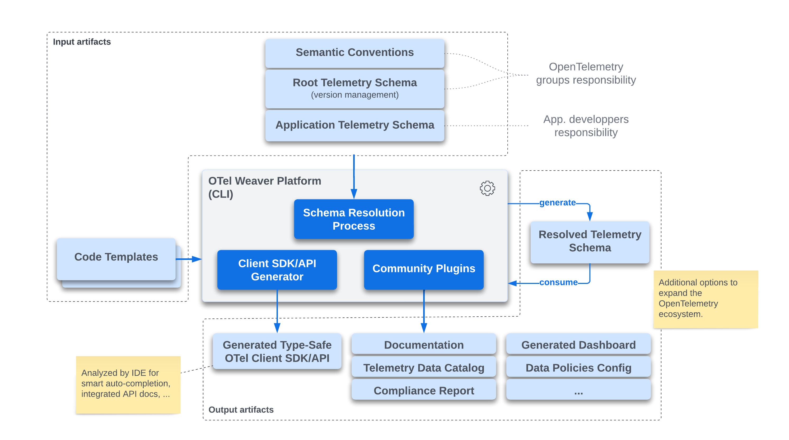

# OTel Weaver (status: Proof of Concept)

## Overview

> At this stage, the project is being used as a **Proof of Concept** to explore and
> refine the 'Application Telemetry Schema: Vision and Roadmap' [OTEP](https://github.com/open-telemetry/oteps/blob/main/text/0243-app-telemetry-schema-vision-roadmap.md),
> which has been approved and merged.
>
> This project is a **work in progress and is not ready for production use**.

OTel Weaver is a CLI tool that enables users to:

- Search for and retrieve information from a semantic convention registry or a telemetry schema.
- Resolve a semantic convention registry or a telemetry schema.
- Generate a client SDK/API from a telemetry schema.

## Install

Currently, there is no binary distribution available. To install the tool, you
must build it from source. To do so, you need to have Rust installed on your
system (see [Install Rust](https://www.rust-lang.org/tools/install)).

To build the tool:
- In debug mode, run the following command:
  ```
  cargo build
  ```
- In release mode, run the following command:
  ```
  cargo build --release
  ```

The generated `weaver` binary will be located in the `target/debug` directory
for debug mode or the `target/release` directory for release mode.

## Usage

```
Usage: weaver [OPTIONS] [COMMAND]

Commands:
  resolve     Resolve a semantic convention registry or a telemetry schema
  gen-client  Generate a client SDK or client API
  languages   List all supported languages
  search      Search in a semantic convention registry or a telemetry schema
  help        Print this message or the help of the given subcommand(s)

Options:
  -d, --debug...  Turn debugging information on
  -h, --help      Print help
  -V, --version   Print version
```

### Command `search`

This command provides an interactive terminal UI, allowing users to search for
attributes and metrics specified within a given semantic convention registry or
a telemetry schema (including dependencies).

To search into the OpenTelemetry Semantic Convention Registry, run the following
command:

```bash
weaver search registry https://github.com/open-telemetry/semantic-conventions.git model 
```

To search into a telemetry schema, run the following command:

```bash
weaver search schema demo/app-telemetry-schema.yaml
```

This search engine leverages [Tantivy](https://github.com/quickwit-oss/tantivy)
and supports a simple [search syntax](https://docs.rs/tantivy/latest/tantivy/query/struct.QueryParser.html)
in the search bar.

### Command `resolve`

This command resolves a schema or a semantic convention registry (not yet
implemented) and displays the result on the standard output.
Alternatively, the result can be written to a file if specified using the
`--output` option. This command is primarily used for validating and debugging
telemetry schemas and semantic convention registries.

```bash
weaver resolve schema telemetry-schema.yaml --output telemetry-schema-resolved.yaml
```

A "resolved schema" is one where:
- All references have been resolved and expanded.
- All overrides have been applied.
- This resolved schema is what the code generator and upcoming plugins utilize.

### Command `gen-client`

This command generates a client SDK from a telemetry schema for a given language
specified with the `--language` option.

```bash
weaver gen-client --schema telemetry-schema.yaml --language go
```

In the future, users will be able to specify the protocol to use for the generated
client SDK (i.e. OTLP or OTel Arrow Protocol) and few others options.

### Command `languages`

This command displays all the languages for which a client SDK/API can
be generated.

```bash
weaver languages
```

### Architecture

The OTel Weaver tool is architecturally designed as a platform. By default, this
tool incorporates a template engine that facilitates Client SDK/API generation
across various programming languages. In the future, we plan to integrate a
WASM plugin system, allowing the community to enhance the platform. This would
pave the way for features like enterprise data catalog integration, privacy policy enforcement,
documentation generation, dashboard creation, and more.

Below is a diagram detailing the primary components of the OTel Weaver tool.



## ToDo
**Semantic Convention Registry and Application Telemetry Schema**
- [ ] Add support for open enum types (i.e. allow custom values=true).
- [ ] Add support for template types.
- [ ] Add support for `all` in telemetry schema versions section.
- [ ] Add support for `span_events` in telemetry schema versions section.
- [ ] Add support for `apply_to_spans` in telemetry schema versions section.
- [ ] Add support for `apply_to_metrics` in telemetry schema metrics versions section.
- [ ] Add support for `split` in telemetry schema metrics versions section.
- [ ] Add support for group constraints `any_of`, ...
- [ ] Support more than 2 levels of telemetry schema inheritance.
- [ ] Minimize number of declaration duplications in the resolved schema (especially for attributes).

**Client SDK/API Code Generation**
- Generate Go Client SDK/API on top of the generic Go Client SDK/API.
  - [ ] Generate type-safe API for metric groups.
  - [ ] Support obfuscation and masking.
- Generate Go Client SDK/API with support for OTel Arrow Protocol.
- Generate Rust Client SDK/API on top of the generic Rust Client SDK/API.
- Generate Rust Client SDK/API with support for OTel Arrow Protocol.

**Tooling and Plugins**
  - [ ] Add support for WASM plugins.
  - [ ] Add Tera filter to apply obfuscation, masking, ... based on tags and language configuration.

## Links

Internal links:
- [Component Telemetry Schema](docs/component-telemetry-schema.md) (proposal)
- [Resolved Telemetry Schema](docs/resolved-telemetry-schema.md) (proposal)
- [Internal crates interdependencies](docs/dependencies.md)
- [Change log](CHANGELOG.md)

External links:
- Application Telemetry Schema: Vision and Roadmap - [PR](https://github.com/open-telemetry/oteps/pull/243)
- OpenTelemetry Telemetry Schema v1.2.0 [Draft](https://github.com/lquerel/oteps/blob/app-telemetry-schema-format/text/0241-telemetry-schema-ext.md) (not yet ready).
- [OpenTelemetry Semantic Convention File Format](https://github.com/open-telemetry/build-tools/blob/main/semantic-conventions/syntax.md)
- [OpenTelemetry Schema File Format v1.1.0](https://opentelemetry.io/docs/specs/otel/schemas/file_format_v1.1.0/)
- Presentation slides from the Semantic Convention SIG meeting on October 23, 2023 [here](https://docs.google.com/presentation/d/1nxt5VFlC1mUjZ8eecUYK4e4SxThpIVj1IRnIcodMsNI/edit?usp=sharing).
- Meta/Facebook's [positional paper](https://research.facebook.com/publications/positional-paper-schema-first-application-telemetry/) 
  presenting a similar approach but based on Thrift+Annotations+Automations.

## Contributing

Pull requests are welcome. For major changes, please open an issue
first to discuss what you would like to change. For more information, please
read [CONTRIBUTING](CONTRIBUTING.md).


## License

OTel Weaver is licensed under Apache License Version 2.0.
