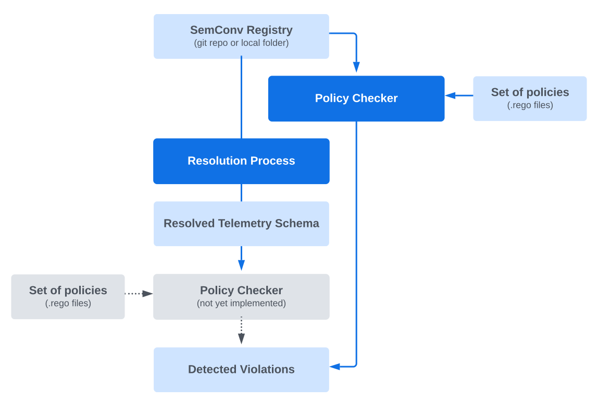

# Weaver Policy Engine

- [Overview](#overview)
- [Objectives](#objectives)
- [Policy Engine Features](#policy-engine-features)
- [Implementation](#implementation)
  - [Policy Definition and Verification](#policy-definition-and-verification)
  - [Usage](#usage)
  - [Policy Examples](#policy-examples)
- [Creating Rules for Findings](#creating-rules-for-findings)
  - [Understanding the `deny` Rule](#understanding-the-deny-rule)
  - [Key Concepts for Rule Development](#key-concepts-for-rule-development)
  - [Step-by-Step Guide to Creating a New Rule](#step-by-step-guide-to-creating-a-new-rule)
- [Links](#links)

## Overview
The Weaver Policy Engine has been developed to enhance the management,
evolution, and maintainability of semantic conventions and application
telemetry schemas. It leverages a set of rules or policies to ensure the
coherence and quality of these conventions and schemas over time. This
documentation outlines the implemented features of the Weaver Policy Engine,
highlighting its goals, implementation details, and how it operates.

## Objectives
The primary objective of the Weaver Policy Engine is to automate the
verification of policies related to semantic conventions and telemetry schemas
before the publication of a new version. These policies aim to maintain the
long-term integrity, coherence, and quality of these conventions and schemas.

Example of policies:
- Prohibiting the use of attributes marked as deprecated unless the 'stability'
  field is set to 'deprecated'.
- Disallowing attributes with high cardinality.
- Prohibiting optional attributes as required by some environments.
- Preventing name changes.
- Preventing the removal of attributes from metrics.
- Requiring the inclusion of 'owners' and 'contacts' fields for metrics, spans,
  and traces.

## Policy Engine Features
- **Decoupled Policy Management**: Policies are defined in separate Rego files,
  allowing for easy updates, extensions, and customization.
- **Automated Verification**: Integration into CI/CD pipelines automates the
  policy verification process, enhancing consistency and reliability.
- **Support for OpenTelemetry and Custom Policies**: The engine supports both
  generic OpenTelemetry policies and company-specific policies, offering
  flexibility in policy enforcement.
- **Enhanced Auditability**: By automating policy checks and maintaining
  policies in versioned files, the Weaver Policy Engine improves audit trails and
  compliance tracking.

## Implementation

### Policy Definition and Verification
The Weaver Policy Engine utilizes the '[Rego](https://www.openpolicyagent.org/docs/latest/policy-language/)'
language, popularized by the [Open Policy Agent](https://www.openpolicyagent.org/) (OPA) project,
for expressing and enforcing policies in a declarative manner. Policies are
written in Rego and can be stored in the semantic conventions repository or a
company-specific repository for custom policies. These policies are then applied
by the Weaver tool during various phases of the development process.

The policy verification process involves:
- Reading the semconv files of both the new and previous versions.
- Applying Rego policies to these files to identify findings (can be `violation`, `informational` or `warning`).
- Displaying any detected policy findings, aiding in the resolution before
  publication.

The following diagram illustrates the policy verification process:


## Policy Stages
Policies can be applied at two different stages of the resolution process.
1) To apply policies before the resolution process, simply group the policies
   into a package named `before_resolution`. 
2) To apply them after the resolution process, the `after_resolution` package
   should be used

The example below presents a set of violation detection rules that will apply
before the validation process.

```rego
package before_resolution

deny[attr_registry_violation("registry_with_ref_attr", group.id, attr.ref)] {
    group := input.groups[_]
    startswith(group.id, "registry.")
    attr := group.attributes[_]
    attr.ref != null
}

# An attribute whose stability is not `deprecated` but has the deprecated field
# set to true is invalid.
deny[attr_violation("attr_stability_deprecated", group.id, attr.id)] {
    group := input.groups[_]
    attr := group.attributes[_]
    attr.stability != "deprecated"
    attr.deprecated
}

# An attribute cannot be removed from a group that has already been released.
deny[schema_evolution_violation("attr_removed", old_group.id, old_attr.id)] {
    old_group := data.groups[_]
    old_attr := old_group.attributes[_]
    not attr_exists_in_new_group(old_group.id, old_attr.id)
}
```

> [!NOTE]
> Note 1: The after_resolution stage is not yet fully supported by Weaver. 

> [!NOTE]
> Note 2: An upcoming version of Weaver will also allow applying rules on two
> distinct versions of the registries (before or after resolution). This will
> enable the definition of schema evolution rules.

### Usage
To verify policies, the command `weaver registry check` can be invoked with one
or more Rego files as parameters. This allows for the specific context-based
verification of policies against semantic conventions and telemetry schemas.

### Policy Examples

Example of a policy expressed in `Rego`:
```rego
package otel

# Conventions for OTel:
# - `data` holds the current released semconv, which is known to be valid.
# - `input` holds the new candidate semconv version, whose validity is unknown.
#
# Note: `data` and `input` are predefined variables in Rego.

# ========= Violation rules applied on unresolved semconv files =========

# A registry `attribute_group` containing at least one `ref` attribute is
# considered invalid.
deny[attr_registry_violation("registry_with_ref_attr", group.id, attr.ref)] {
    group := input.groups[_]
    startswith(group.id, "registry.")
    attr := group.attributes[_]
    attr.ref != null
}

# An attribute whose stability is not `deprecated` but has the deprecated field
# set to true is invalid.
deny[attr_violation("attr_stability_deprecated", group.id, attr.id)] {
    group := input.groups[_]
    attr := group.attributes[_]
    attr.stability != "deprecated"
    attr.deprecated
}

# An attribute cannot be removed from a group that has already been released.
deny[schema_evolution_violation("attr_removed", old_group.id, old_attr.id)] {
    old_group := data.groups[_]
    old_attr := old_group.attributes[_]
    not attr_exists_in_new_group(old_group.id, old_attr.id)
}


# ========= Helper functions =========

# Check if an attribute from the old group exists in the new
# group's attributes
attr_exists_in_new_group(group_id, attr_id) {
    new_group := input.groups[_]
    new_group.id == group_id
    attr := new_group.attributes[_]
    attr.id == attr_id
}

# Build an attribute registry violation
attr_registry_violation(violation_id, group_id, attr_id) = violation {
    violation := {
        "id": violation_id,
        "type": "semconv_attribute",
        "category": "attribute_registry",
        "group": group_id,
        "attr": attr_id,
    }
}

# Build an attribute violation
attr_violation(violation_id, group_id, attr_id) = violation {
    violation := {
        "id": violation_id,
        "type": "semconv_attribute",
        "category": "attribute",
        "group": group_id,
        "attr": attr_id,
    }
}

# Build a schema evolution violation
schema_evolution_violation(violation_id, group_id, attr_id) = violation {
    violation := {
        "id": violation_id,
        "type": "semconv_attribute",
        "category": "schema_evolution",
        "group": group_id,
        "attr": attr_id,
    }
}
```

These policies applied to the following semconv file...

The already released version (data):
```yaml
groups:
  - id: registry.network1
    prefix: network
    type: attribute_group
    brief: >
      These attributes may be used for any network related operation.
    attributes:
      - id: protocol.name
        stability: stable
        type: string
        brief: '[OSI application layer](https://osi-model.com/application-layer/) or non-OSI equivalent.'
        note: The value SHOULD be normalized to lowercase.
        examples: ['amqp', 'http', 'mqtt']
        deprecated: true
      - id: protocol.name.3
        stability: stable
        type: string
        brief: '[OSI application layer](https://osi-model.com/application-layer/) or non-OSI equivalent.'
        note: The value SHOULD be normalized to lowercase.
        examples: ['amqp', 'http', 'mqtt']
```

The unreleased version (input):
```yaml
groups:
  - id: registry.network
    prefix: network
    type: attribute_group
    brief: >
      These attributes may be used for any network related operation.
    attributes:
      - id: protocol.name.1
        stability: stable
        type: string
        brief: '[OSI application layer](https://osi-model.com/application-layer/) or non-OSI equivalent.'
        note: The value SHOULD be normalized to lowercase.
        examples: ['amqp', 'http', 'mqtt']
        deprecated: true
      - id: protocol.name.2
        stability: stable
        type: string
        brief: '[OSI application layer](https://osi-model.com/application-layer/) or non-OSI equivalent.'
        note: The value SHOULD be normalized to lowercase.
        examples: ['amqp', 'http', 'mqtt']
      - ref: protocol.port
        deprecated: true
```

... will generate the following findings.

```json
[
  {
    "type": "semconv_attribute",
    "id": "attr_stability_deprecated",
    "category": "attribute",
    "group": "registry.network1",
    "attr": "protocol.name"
  },
  {
    "type": "semconv_attribute",
    "id": "attr_removed",
    "category": "schema_evolution",
    "group": "registry.network1",
    "attr": "protocol.name.3"
  },
  {
    "type": "semconv_attribute",
    "id": "registry_with_ref_attr",
    "category": "attribute_registry",
    "group": "registry.network1",
    "attr": "protocol.port"
  }
]
```

## Creating Rules for Findings

The Weaver Policy Engine allows for the dynamic creation and enforcement of
rules to maintain the integrity and consistency of semantic conventions and
telemetry schemas. By leveraging the Rego language, developers can specify
policies that define what constitutes a finding within these domains. This
section explains how to craft rules for detecting new finding, enhancing the
engine's capability to safeguard the quality and coherence of semantic
conventions and application telemetry schemas.

### Understanding the `deny` Rule

The `deny` rule serves as the cornerstone for defining policy finding. When
the conditions specified within a `deny` rule are met, it indicates a policy
finding. Each `deny` rule must uniquely identify the finding it detects by
producing a descriptive message or a structured object that outlines the nature
of the finding.

### Key Concepts for Rule Development

- **Rule Name**: Rules detecting a finding (e.g. detecting issues or violations)
  must be named `deny`. This is a convention chosen by the Weaver project to
  facilitate the use and management of these policy files.
- **Finding Conditions**: The body of a `deny` rule contains one or more
  conditions that, when true, signal a finding. These conditions can range from
  simple checks, like the presence of a deprecated attribute, to complex validations
  involving multiple components of the semantic conventions or telemetry schemas.
- **Finding Message**: Upon detecting a finding, the rule should generate a
  message or an object that provides detailed information about the finding,
  including an id, the severity level, a human readable description, and
  any other relevant context you would like to attach.

### Step-by-Step Guide to Creating a New Rule

1. **Identify the Finding**: Determine the specific condition or practice that
   should be flagged as a finding. This could be a new policy requirement, a best
   practice, or an identified gap in the current policy enforcement.

2. **Define the Rule Conditions**: Craft a set of conditions that accurately
   capture the criteria for the finding. Utilize the Rego language to express
   these conditions, making use of variables, functions, and operators as necessary.

3. **Construct the Finding Output**: For defining the structure of the finding
   object.

4. **Implement the Rule in Rego**: Write the `deny` rule in Rego, encapsulating
   the conditions and finding output you've defined. Ensure the rule is clearly
   commented and documented to facilitate understanding and maintenance.

5. **Test the Rule**: Before integrating the new rule into the Weaver Policy
   Engine, test it with various input scenarios to ensure it accurately detects
   finding without producing false positives or negatives. A unit test
   framework will be provided to facilitate this process in a future PR.

## Links
- [Rego Language Reference](https://www.openpolicyagent.org/docs/latest/policy-language/).