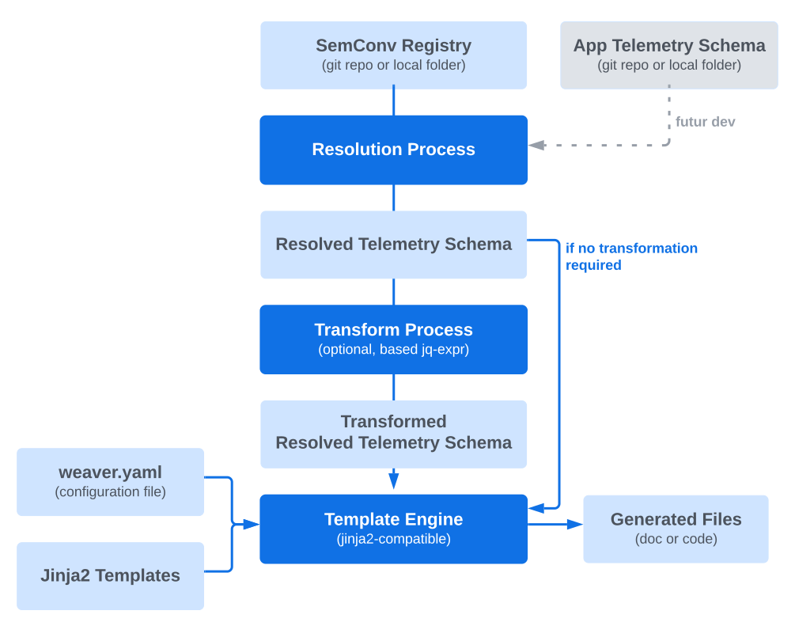

# Weaver Forge - Template Engine

- [Introduction](#introduction)
- [Template Directory Structure and Naming Conventions](#template-directory-structure-and-naming-conventions)
- [Configuration File - `weaver.yaml`](#configuration-file---weaveryaml)
- [Jinja Filters](#jinja-filters)
- [Jinja Functions](#jinja-functions)
- [Jinja Tests](#jinja-tests)

## Introduction

OTel Weaver is capable of generating documentation or code from a semantic
convention registry or a telemetry schema (phase 2). To do this,
OTel Weaver uses a template engine compatible with the Jinja2 syntax (see the
[MiniJinja](https://github.com/mitsuhiko/minijinja) project for more details).
A set of filters, functions, tests, and naming conventions have been added to
the classic Jinja logic to make the task easier for template authors.

The following diagram illustrates the documentation and code generation pipeline
using the OTel Weaver tool:



## Template Directory Structure and Naming Conventions

By default, the OTel Weaver tool expects to find a templates directory in the
current directory.

```plaintext
templates/
  registry/
    go/                     <-- Templates to generate the semantic conventions in Go
      ...
    html/                   <-- Templates to generate the semantic conventions in HTML
      ...
    markdown/               <-- Templates to generate the semantic conventions in markdown
      ... 
    rust/                   <-- Templates to generate the semantic conventions in Rust
      ...  
    go/                     <-- Templates to generate the semantic conventions in Go
      ...
  schema/
    sdk-go/                 <-- Templates to generate a Go Client SDK derived from the telemetry schema
      ...
    sdk-rust/               <-- Templates to generate a Rust Client SDK derived from the telemetry schema
      ...
```

The command `weaver generate registry markdown` will generate the markdown
files based on the templates located in the `templates/registry/markdown`.

When the name of a file (excluding the extension) matches a recognized pattern
(e.g., attribute_group, groups, ...), OTel Weaver extracts the objects from the
registry and passes them to the template at the time of its evaluation.
Depending on the nature of the pattern, the template is evaluated as many times
as there are objects that match or only once if the pattern corresponds to a
set of objects. By default, the name of the file that will be generated from
the template will be that of the template, but it is possible within the
template to dynamically redefine the name of the produced file.

For example, the following snippet redefine the name of the file that will be
produced from the template:

```jinja

{{- template.set_file_name("span/" ~ file_name ~ ".md") -}}
```

This mechanism allows the template to dynamically generate the name of the file
to be produced and to organize the generated files in a directory structure of
its choice.

## Configuration File - `weaver.yaml`

The configuration file `weaver.yaml` is optional. See the [Weaver Configuration File](/docs/weaver-config.md)
documentation for more details.

## Global Variables

All templates have access to the following global variables:
- `ctx`: The context object that contains the resolved registry or the output of
the JQ filter if defined in the `weaver.yaml` configuration file.
- `params`: The parameters defined in the `weaver.yaml` configuration file or overridden
by the command line `--param`, `-D`, or `--params` arguments.
- `template`: An object exposing the `set_file_name` method to redefine the name of the
file that will be produced from the template.

In the following example, the parameters `incubating` and `excluded` are passed via the command line:

```shell
weaver registry generate --param incubating=true <target> <output-dir>
```

The `weaver.yaml` configuration file can specify default values for the parameters and can also
access the parameters in the JQ filters:

```yaml
params:
  incubating: false
  registry_prefix: "registry."

templates:
  - pattern: <glob-pattern>
    filter: >
      if $incubating then
        .groups
          | map(select(.type == "attribute_group"))
          | map(select(.id | startswith($registry_prefix)))
          | map({ id: .id, group_id: .id | split(".") | .[1], attributes: .attributes })
          | group_by(.group_id)
          | map({ id: .[0].group_id, attributes: [.[].attributes[]] | sort_by(.id), output: "_incubating/attributes/", stable_package_name: "opentelemetry.semconv.attributes" })
          | map(select(.id as $id | any($excluded[]; . == $id) | not))
          | map(select(.attributes | length > 0))
      else
        empty
      end
      application_mode: single | each
```

Jinja templates can also access the parameters:

```jinja
...

... generate incubating code ...

...
```

## Jinja Filters

All the filters available in the MiniJinja template engine are available (see
this online [documentation](https://docs.rs/minijinja/latest/minijinja/filters/index.html)). 

In addition, OTel Weaver provides a set of custom filters to facilitate the
generation of documentation and code.

The following filters are available:
- `lower_case`: Converts a string to lowercase.
- `upper_case`: Converts a string to UPPERCASE.
- `title_case`: Converts a string to TitleCase.
- `pascal_case`: Converts a string to PascalCase.
- `camel_case`: Converts a string to camelCase.
- `snake_case`: Converts a string to snake_case.
- `screaming_snake_case`: Converts a string to SCREAMING_SNAKE_CASE.
- `kebab_case`: Converts a string to kebab-case.
- `screaming_kebab_case`: Converts a string to SCREAMING-KEBAB-CASE.
- `capitalize_first`: Capitalizes the first letter of a string.
- `acronym`: Replaces acronyms in the input string with the full name defined in the `acronyms` section of the `weaver.yaml` configuration file.
- `split_ids`: Splits a string by '.' creating a list of nested ids.
- `type_mapping`: Converts a semantic convention type to a target type (see weaver.yaml section `type_mapping`).
- `comment_with_prefix(prefix)`: Outputs a multiline comment with the given prefix.
- `flatten`: Converts a List of Lists into a single list with all elements.
e.g. \[\[a,b\],\[c\]\] => \[a,b,c\]
- `attribute_sort`: Sorts a list of `Attribute`s by requirement level, then name.
- `metric_namespace`: Converts registry.{namespace}.{other}.{components} to {namespace}.
- `attribute_registry_file`: Converts registry.{namespace}.{other}.{components} to attributes-registry/{namespace}.md (kebab-case namespace).
- `attribute_registry_title`: Converts registry.{namespace}.{other}.{components} to {Namespace} (title case the namespace).
- `attribute_registry_namespace`: Converts metric.{namespace}.{other}.{components} to {namespace}.
- `attribute_namespace`: Converts {namespace}.{attribute_id} to {namespace}.
- `required`: Filters a list of `Attribute`s to include only the required attributes. The "conditionally_required" attributes are not returned by this filter.
- `not_required`: Filters a list of `Attribute`s to only include non-required attributes. The "conditionally_required" attributes are returned by this filter.
- `instantiated_type`: Filters a type to return the instantiated type. 
- `enum_type`: Filters a type to return the enum type or an error if the type is not an enum.
- `markdown_to_html`: Converts a markdown string to an HTML string.
- `map_text`: Converts an input into a string based on the `text_maps` section of the `weaver.yaml` configuration file
and a named text_map. The first parameter is the name of the text_map (required). The second parameter is the default
value if the name of the text map or the input are not found in the `text_maps` section (optional).
- `ansi_black`: Format a text using the black ansi code.
- `ansi_red`: Format a text using the red ansi code.
- `ansi_green`: Format a text using the green ansi code.
- `ansi_yellow`: Format a text using the yellow ansi code.
- `ansi_blue`: Format a text using the blue ansi code.
- `ansi_magenta`: Format a text using the magenta ansi code.
- `ansi_cyan`: Format a text using the cyan ansi code.
- `ansi_white`: Format a text using the white ansi code.
- `ansi_bright_black`: Format a text using the bright black ansi code.
- `ansi_bright_red`: Format a text using the bright red ansi code.
- `ansi_bright_green`: Format a text using the bright green ansi code.
- `ansi_bright_yellow`: Format a text using the bright yellow ansi code.
- `ansi_bright_blue`: Format a text using the bright blue ansi code.
- `ansi_bright_magenta`: Format a text using the bright magenta ansi code.
- `ansi_bright_cyan`: Format a text using the bright cyan ansi code.
- `ansi_bright_white`: Format a text using the bright white ansi code.
- `ansi_bg_black`: Format a text using the black background ansi code.
- `ansi_bg_red`: Format a text using the red background ansi code.
- `ansi_bg_green`: Format a text using the green background ansi code.
- `ansi_bg_yellow`: Format a text using the yellow background ansi code.
- `ansi_bg_blue`: Format a text using the blue background ansi code.
- `ansi_bg_magenta`: Format a text using the magenta background ansi code.
- `ansi_bg_cyan`: Format a text using the cyan background ansi code.
- `ansi_bg_white`: Format a text using the white background ansi code.
- `ansi_bg_bright_black`: Format a text using the bright black background ansi code.
- `ansi_bg_bright_red`: Format a text using the bright red background ansi code.
- `ansi_bg_bright_green`: Format a text using the bright green background ansi code.
- `ansi_bg_bright_yellow`: Format a text using the bright yellow background ansi code.
- `ansi_bg_bright_blue`: Format a text using the bright blue background ansi code.
- `ansi_bg_bright_magenta`: Format a text using the bright magenta background ansi code.
- `ansi_bg_bright_cyan`: Format a text using the bright cyan background ansi code.
- `ansi_bg_bright_white`: Format a text using the bright white background ansi code.
- `ansi_bold`: Format a text using the bold ansi code.
- `ansi_italic`: Format a text using the italic ansi code.
- `ansi_underline`: Format a text using the underline ansi code.
- `ansi_strikethrough`: Format a text using the strikethrough ansi code.

> Please open an issue if you have any suggestions for new filters. They are easy to implement.

## Jinja Functions

All the functions available in the MiniJinja template engine are available (see 
this online [documentation](https://docs.rs/minijinja/latest/minijinja/functions/index.html)).

Right now, OTel Weaver does not provide any custom functions but feel free to
open an issue if you have any suggestions. They are easy to implement.

## Jinja Tests

All the tests available in the MiniJinja template engine are available (see
this online [documentation](https://docs.rs/minijinja/latest/minijinja/tests/index.html)).

In addition, OTel Weaver provides a set of custom tests to facilitate the
generation of assets.

- `stable`: Tests if an `Attribute` is stable.
- `experimental`: Tests if an `Attribute` is experimental.
- `deprecated`: Tests if an `Attribute` is deprecated.
- `enum`: Tests if an attribute has an enum type.
- `simple_type`: Tests if a type is a simple type (i.e.: string | string[] | int | int[] | double | double[] | boolean | boolean[]).
- `template_type`: Tests if a type is a template type (i.e.: template[]).
- `enum_type`: Tests if a type is an enum type.

> Please open an issue if you have any suggestions for new tests. They are easy to implement.