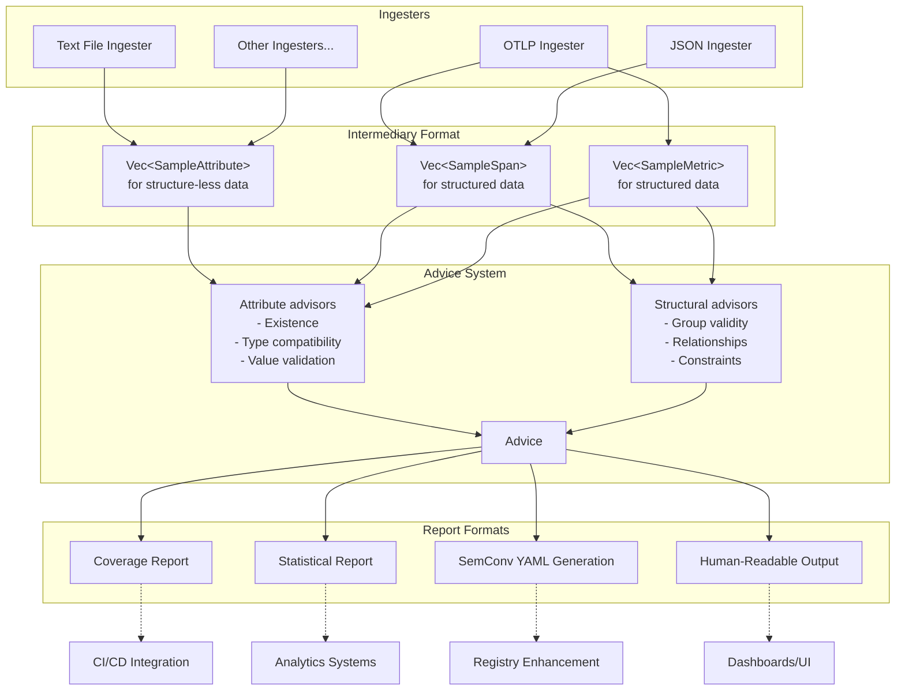

# Weaver Health

## 1. Overview

The weaver-health system provides a decoupled, flexible, extensible framework for health checking sample telemetry. It transforms various input formats into standardized intermediary representations that can be assessed by advisors against expected patterns or values. The output results use the standard weaver templated process for full flexibility.



## 2. Architecture

### 2.1 Core Components

The weaver-health system comprises four main components:

1. **Ingesters**: Transform specific input formats into intermediary formats
2. **Intermediary Formats**: Standardized representations of telemetry data
3. **Advice System**: Compares intermediary data with expected patterns
4. **Report Formats**: Structured outputs for various downstream uses

### 2.2 Intermediary Formats

Intermediary formats are used for attributes and groups:

1. **Vec\<SampleAttribute\>**
   - Used for structure-less or flat data
   - Contains attribute metadata with optional sample values
   - Supports basic attribute presence and value checks

2. **Vec\<SampleSpan\>, Vec\<SampleMetric\>, ...**
   - Used for fully structured telemetry data
   - Contains complete metadata e.g. Spans, Metrics, ...
   - Supports comprehensive structural and relationship validation

### 2.3 Data Flow

1. Input data is received by an appropriate ingester
2. The ingester transforms the input into its predetermined output format either attributes only or group types
3. The advice system runs appropriate comparisons on the intermediary format
4. Advice is collected into a list for each entity
5. Results are transformed into various report formats for different downstream uses (coverage reports, statistical analysis, YAML generation, human-readable output)

### 2.4 Advice system

Advisors implement a simple trait and are called during the health-check run. The design allows for simple and high-complexity advisors. For example, a simple snake_case checker or an LLM advisor. The advisors you wish to use are configured at the CLI for the run. Each advisor returns an `Option<Advice>` - None means there's nothing negative to advise on. Here is a JSON output for an attribute level health-check:

```json
[
    {
        "sample_attribute": {
            "name": "aws.s3.bucket"
        },
        "all_advice": []
    },
    {
        "sample_attribute": {
            "name": "aws.s3.bucket.name"
        },
        "all_advice": [
            {
                "key": "attribute_match",
                "value": false,
                "message": "This attribute does not exist in the registry"
            }
        ]
    },
    {
        "sample_attribute": {
            "name": "task.id"
        },
        "all_advice": [
            {
                "key": "attribute_match",
                "value": false,
                "message": "This attribute does not exist in the registry"
            }
        ]
    },
    {
        "sample_attribute": {
            "name": "TaskId"
        },
        "all_advice": [
            {
                "key": "attribute_match",
                "value": false,
                "message": "This attribute does not exist in the registry"
            },
            {
                "key": "correct_case",
                "value": false,
                "message": "This attribute is not in snake case"
            }
        ]
    }
]
```

## 3. Usage Examples

Pipe a list of attributes to the `AttributeStdin` ingestor.

```sh
cat attributes.txt | weaver registry health --ingester as
```

Or a redirect

```sh
weaver registry health --ingester as < attributes.txt
```

Or a here-doc

```sh
weaver registry health --ingester as << EOF
code.function
thing.blah
EOF
```

Using `emit` for a round-trip test:

```sh
weaver registry health --ingester ao -r ../semantic-conventions/model --output ./outdir &
HEALTH_PID=$!
sleep 3
weaver registry emit -r ../semantic-conventions/model --skip-policies
kill -HUP $HEALTH_PID
wait $HEALTH_PID
```

Vendor example: Health check column names in a Honeycomb dataset

```sh
curl -s -X GET 'https://api.honeycomb.io/1/columns/{dataset}' -H 'X-Honeycomb-Team: {API_KEY}' \
| jq -r '.[].key_name' \
| weaver registry health --ingester as -r ../semantic-conventions/model
```
