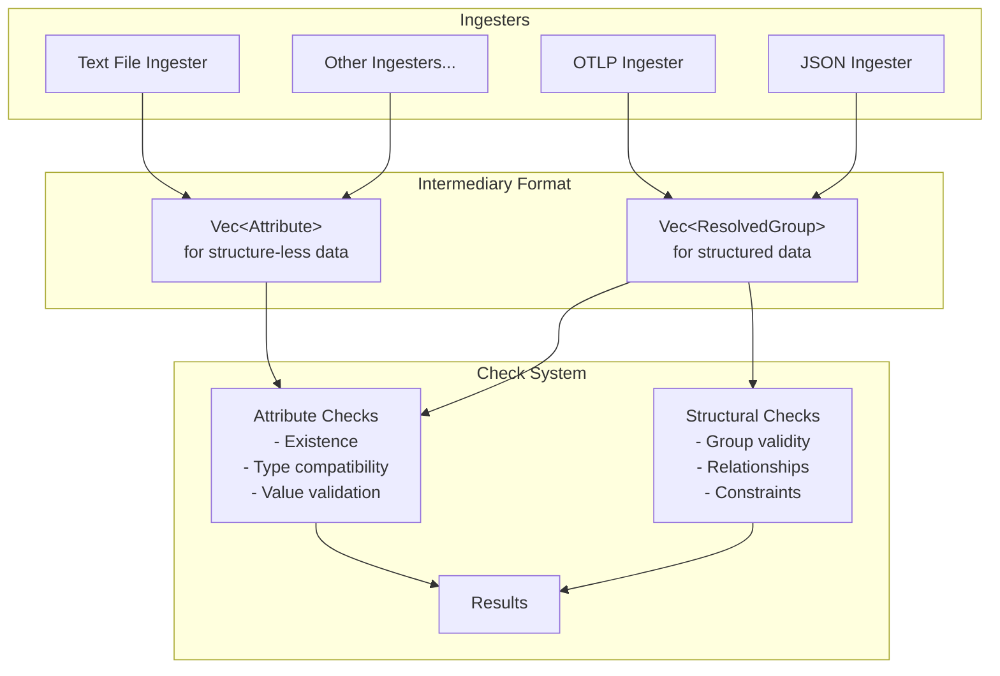

# Weaver Health System Specification

## 1. Overview

The weaver-health system provides a framework for validating telemetry data by decoupling ingestion from validation. It transforms various input formats into standardized intermediary representations that can be assessed against expected patterns or values.



## 2. Architecture

### 2.1 Core Components

The live-check system comprises three main components:

1. **Ingesters**: Transform specific input formats into intermediary formats
2. **Intermediary Formats**: Standardized representations of telemetry data 
3. **Check System**: Validates intermediary data against expected patterns

### 2.2 Intermediary Formats

Two primary intermediary formats are used:

1. **Vec\<Attribute\>**
   - Used for structure-less or flat data
   - Contains attribute metadata with optional sample values
   - Supports basic attribute presence and value checks

2. **Vec\<ResolvedGroup\>**
   - Used for fully structured telemetry data
   - Handles multiple telemetry groups in a single ingestion
   - Contains complete metadata e.g. Spans, Metrics, ...
   - Supports comprehensive structural and relationship validation

### 2.3 Data Flow

1. Input data is received by an appropriate ingester
2. The ingester transforms the input into its predetermined output format (either Vec\<Attribute\> or Vec\<ResolvedGroup\>)
3. The check system runs appropriate validations on the intermediary format
4. Results are collected and reported

## 3. Ingesters

### 3.1 Generic Ingester Trait

Ingesters implement a generic trait that specifies both their input and output types:

```rust
trait Ingester<I, O> {
    fn ingest(&self, input: I) -> Result<O, IngestError>;
}

// The two possible output formats
type AttributeOutput = Vec<Attribute>;
type ResolvedGroupOutput = Vec<ResolvedGroup>;

// Each ingester implementation declares its input and output types
struct OtlpIngester;
impl Ingester<&[u8], ResolvedGroupOutput> for OtlpIngester { /* ... */ }

struct JsonIngester;
impl Ingester<&str, ResolvedGroupOutput> for JsonIngester { /* ... */ }

struct TextFileIngester;
impl Ingester<&str, AttributeOutput> for TextFileIngester { /* ... */ }

// An ingester that works directly with a file path
struct FileIngester;
impl Ingester<&Path, AttributeOutput> for FileIngester { /* ... */ }
```

### 3.2 Specific Ingesters

Each ingester is purpose-built for a specific input format and produces a predetermined output format. There is no dynamic format selection within the ingester. Some examples:

#### 3.2.1 OTLP Ingester

- Always produces Vec\<ResolvedGroup\> format
- Extracts full structure from OTLP protocol buffers
- Maps OTLP data models to appropriate semantic convention structures

#### 3.2.2 JSON Ingester

- Produces Vec\<ResolvedGroup\> format
- Interprets JSON structure and maps to semantic convention structures
- Built specifically to handle JSON with known structure

#### 3.2.3 Text File Ingester

- Produces Vec\<Attribute\> format
- Extracts attribute names and values from plain text files
- Designed for simpler, unstructured inputs

#### 3.2.4 Other Ingesters

Additional ingesters can be implemented for various data sources following the same pattern. Perhaps calling a vendor's API to retrieve attribute datasets for example.

## 4. Check System

### 4.1 Check Types

#### 4.1.1 Attribute Checks

Work with either intermediary format and are inspired by honey-health tool functionality:

- **Existence Check**: Verifies attribute presence in semantic conventions
  - Reports attributes marked as "Missing" from semantic conventions
  - Suggests similar attributes or namespaces that might be relevant

- **Naming Convention Check**: Validates attribute naming follows OTEL standards
  - Detects camelCase vs snake_case issues ("WrongCase")
  - Identifies attributes without proper namespacing ("NoNamespace")
  - Flags non-standard naming patterns

- **Type Check**: Validates attribute type against schema
  - Ensures types match semantic convention definitions
  - Reports type mismatches or inconsistencies

- **Enum Compatibility**: Checks if values match defined enum variants
  - Identifies undefined variants used in telemetry
  - Reports extra variants not in the specification (similar to honey-health `-e` flag)

#### 4.1.2 Structural Checks

Require Vec\<ResolvedGroup\> format:

- **Group Validity**: Verifies structural integrity of the group
  - Checks if span, event, or metric attributes conform to their defined type

- **Required Elements**: Ensures required attributes are present
  - Differentiates between required and recommended attributes
  - Reports on conditional requirements

### 4.2 Check Interface

```rust
// Core check trait
trait Check {
    fn execute(&self) -> CheckResult;
    fn description(&self) -> String;
}

// Detailed check result structure
struct CheckResult {
    success: bool,
    severity: Severity,
    location: String,
    message: String,
    suggestion: Option<String>,
    similar_items: Vec<SimilarItem>,
    metadata: HashMap<String, String>,
}

// Severity levels for results
enum Severity {
    Error,      // Critical issue that should be fixed
    Warning,    // Non-critical issue that should be reviewed
    Info,       // Informational message
}

// Information about similar items for suggestions
struct SimilarItem {
    name: String,
    similarity_score: f32,
    reason: String,
}

// Example implementation for attribute existence check
struct AttributeExistenceCheck {
    attribute_name: String,
    registry: Registry,
}

impl Check for AttributeExistenceCheck {
    fn execute(&self) -> CheckResult {
        // Check if attribute exists in registry
        // Generate suggestions for missing attributes
        // Return appropriate CheckResult
        // ...
    }
    
    fn description(&self) -> String {
        format!("Check if attribute '{}' exists in semantic conventions", 
                self.attribute_name)
    }
}
```

### 4.3 Check Runner and Results Reporting

The check system runs checks and collects results into useful reports:

```rust
// Generic CheckRunner trait
trait CheckRunner<T, R> {
    fn run_checks(&self, data: &T) -> R;
}

// Implementations for different data types (abbreviated)
struct AttributeCheckRunner {
    registry: Arc<Registry>,
}

impl CheckRunner<AttributeOutput, AttributeCheckReport> for AttributeCheckRunner {
    fn run_checks(&self, attributes: &AttributeOutput) -> AttributeCheckReport {
        // Run various checks on attributes
        // Collect and return results
        // ...
    }
}

// Report structure similar to honey-health output
struct AttributeCheckReport {
    match_count: usize,
    miss_count: usize,
    bad_count: usize,
    results: Vec<CheckResult>,
}

impl AttributeCheckReport {
    // Methods to add results, calculate scores, and format reports
    // ...
    
    // Format report similar to honey-health output
    fn format_console_report(&self, dataset_name: &str) -> String {
        // Generate formatted report similar to honey-health
        // ...
    }
}
```

### 4.4 Example Check Results

Below are examples of check results formatted similarly to the honey-health tool output:

#### Single Dataset Report

```
  Dataset  Match Miss  Bad  Score
  dataset3    28   11    2  68.3%

              Column Suggestion
  aws.s3.bucket.name Missing  Extends aws.s3; Similar to aws.s3.bucket
             task.id Missing
              TaskId Bad      WrongCase; NoNamespace  
```

This report shows:
- 28 attributes match semantic conventions
- 11 attributes are missing from semantic conventions
- 2 attributes have naming issues
- Overall score of 68.3% compliance

The detail section shows specific issues:
- `aws.s3.bucket.name` is missing but extends the `aws.s3` namespace and is similar to `aws.s3.bucket`
- `task.id` is missing with no suggestions
- `TaskId` has incorrect casing and lacks a namespace

#### Enum Check Report

```
                  Column Undefined-variants
            browser.type
            message.type
                 os.type Linux, Windows 10, Mac OS
              rpc.system jsonrpc
                rpc.type error
  telemetry.sdk.language
```

This report shows attributes with enum type and any observed values not defined in the semantic conventions:
- `os.type` has undefined variants: "Linux", "Windows 10", "Mac OS"
- `rpc.system` has the undefined variant "jsonrpc"
- `rpc.type` has the undefined variant "error"
- Other attributes are enum types but have no undefined variants

## 5. Implementation Details

### 5.1 ResolvedGroup Creation

For generating sparse `ResolvedGroup` instances:

```rust
struct ResolvedGroupBuilder {
    group: ResolvedGroup,
}

impl ResolvedGroupBuilder {
    fn new(id: &str) -> Self { /* ... */ }
    fn with_attributes(mut self, attributes: Vec<Attribute>) -> Self { /* ... */ }
    /* ... */
    fn build(self) -> ResolvedGroup { /* ... */ }
}
```

### 5.2 Type Inference

For Vec\<Attribute\> with sample values:

```rust
fn infer_attribute_type(name: &str, sample_value: &Value) -> Result<AttributeType, InferenceError> {
    // Map sample values to attribute types
}

fn check_enum_compatibility(attribute: &Attribute, sample_value: &Value) -> bool {
    // Verify sample values against enum variants
}
```

### 5.3 Error Handling

```rust
enum IngestError {
    ParseError(String),
    UnsupportedFormat(String),
    InvalidData(String),
}

enum CheckError {
    InvalidCheck(String),
    ExecutionFailure(String),
}
```

## 6. Extension Points

The system is designed to be extendable in several ways:

1. **New Ingesters**: For additional data formats
2. **New Check Types**: For specialized validation rules
3. **Custom Type Inferrers**: For domain-specific type inference
4. **Reporting Integrations**: For various output and alerting mechanisms

## 7. Usage Examples

### 7.1 Basic Usage

```rust
// Process with a JSON ingester (takes string data)
let json_ingester = JsonIngester::new();
let json_string = std::str::from_utf8(&json_bytes)?;
let resolved_groups: Vec<ResolvedGroup> = json_ingester.ingest(json_string)?;

// or, Process with a file path ingester
use std::path::Path;
let file_ingester = FileIngester::new();
let attributes: Vec<Attribute> = file_ingester.ingest(Path::new("attributes.txt"))?;

// Run checks based on the data type
let attribute_runner = AttributeCheckRunner::new();
let group_runner = ResolvedGroupCheckRunner::new();

// Run appropriate checks based on data type
let results = group_runner.run_checks(&resolved_groups);
// or
let results = attribute_runner.run_checks(&attributes);
```

### 7.2 Creating Custom Checks

```rust
struct CustomAttributeCheck {
    attribute_name: String,
    predicate: Box<dyn Fn(&Attribute) -> bool>,
    message: String,
}

impl Check for CustomAttributeCheck {
    fn execute(&self) -> CheckResult {
        // Implementation
    }
    
    fn description(&self) -> String {
        self.message.clone()
    }
}
```

## 8. Future Considerations

1. **Caching**: Optimization for repetitive checks
2. **Rule-Based Configuration**: Define checks via configuration
3. **Streaming Support**: Processing continuous data streams
4. **Visualization**: Graphical representation of check results
5. **Machine Learning**: Anomaly detection for telemetry patterns, better suggestions.
