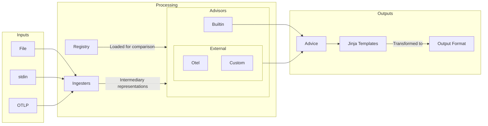

# Weaver Live Check

Live check is a developer tool for assessing sample telemetry and providing findings for improvement.

A Semantic Convention `Registry` is loaded for comparison with samples. `Ingesters` transform various input formats and sources into intermediary representations to be assessed by `Advisors`. The `PolicyFinding` produced is transformed via jinja templates to the required output format for downstream consumption.



## Ingesters

Sample data can have various levels of detail; from a simple list of attribute names, to a full OTLP signal structure. This data can come from different sources: files, stdin, OTLP. Therefore you need to choose the appropriate `Ingester` for your job by setting two parameters: `--input-source`, `--input-format`

| Input Source   | Input Format |                                                         |
| -------------- | ------------ | ------------------------------------------------------- |
| `otlp`         | N/A          | OTLP signals (default)                                  |
| &lt;file path> | `text`       | Text file with attribute names or name=value pairs      |
| `stdin`        | `text`       | Standard input with attribute names or name=value pairs |
| &lt;file path> | `json`       | JSON file with an array of samples                      |
| `stdin`        | `json`       | Standard input with a JSON array of samples             |

Some `Ingesters`, like `stdin` and `otlp`, can stream the input data so you receive output at the command line as it comes in. This is really useful in live debugging sessions allowing you to breakpoint, step through your code and see live assessment as the data is received in Weaver.

### OTLP

OTLP live-check is particularly useful in CI/CD pipelines to evaluate the quality of instrumentation observed from all unit tests, integration tests and so on.

This `Ingester` starts an OTLP listener and streams each received OTLP message to the `Advisors`. The currently supported stop conditions are: CTRL+C (SIGINT), SIGHUP, the HTTP /stop endpoint, and a maximum duration of no OTLP message reception. See the usage examples later in this document.

Options for OTLP ingest:

- `--otlp-grpc-address`: Address used by the gRPC OTLP listener
- `--otlp-grpc-port`: Port used by the gRPC OTLP listener
- `--admin-port`: Port used by the HTTP admin port (endpoints: /stop)
- `--inactivity-timeout`: Max inactivity time in seconds before stopping the listener

## Advisors

Sample entities are assessed by the set of `Advisors` and augmented with `Advice`. Built-ins check for fundamental compliance with the `Registry` supplied, for example `missing_attribute` and `type_mismatch`.

Beyond the fundamentals, external `Advisors` can be defined in Rego policies. The OpenTelemetry Semantic Conventions rules are included out-of-the-box by default. They provide `Advice` on name-spacing and formatting aligned with the standard. These default policies can be overridden at the command line with your own.

### PolicyFinding

As mentioned, a list of `PolicyFinding` is returned in the report for each sample entity. The snippet below shows `PolicyFinding` from one `Advisor`, a builtin providing `missing_attribute`. The fields of `PolicyFinding` are intended to be used like so:

- `level`: _string_ - one of `violation`, `improvement` or `information` with that order of precedence. Weaver will return with a non-zero exit-code if there is any `violation` in the report.
- `id`: _string_ - a simple machine readable string to group findings of a particular kind or type.
- `signal_type`: _string_ - a type of the signal for which the finding is reported: `metric`, `span`, `event` or `resource`
- `signal_name`: _string_ - a name of the signal for which the finding is reported: metric name, event name or span name
- `context`: _any_ - a map that describes details about the finding in a structured way,
  for example `{ "attribute_name": "foo.bar", "attribute_value": "bar" }`.
- `message`: _string_ - verbose string describing the finding. It contains the same details as `context` but
  is formatted and human-readable.

```json
{
  "live_check_result": {
    "all_advice": [
      {
        "level": "violation",
        "id": "missing_attribute",
        "message": "Attribute `hello` does not exist in the registry.",
        "context": {"attribute_name": "hello"},
        "signal_name": "http.client.request.duration",
        "signal_type": "metric"
      }
    ],
    "highest_advice_level": "violation"
  },
  "name": "hello",
  "type": "string",
  "value": "world"
}
```

> **Note**
> The `live_check_result` object augments the sample entity at the pertinent level in the structure. If the structure is `metric`->`[number_data_point]`->`[attribute]`, finding should be given at the `number_data_point` level for, say, required attributes that have not been supplied. Whereas, an attribute finding, like `missing_attribute` in the JSON above, is given at the attribute level.

### Custom advisors

Use the `--advice-policies` command line option to provide a path to a directory containing Rego policies with the `live_check_advice` package name. Here's a very simple example that rejects any attribute name containing the string "test":

```rego
package live_check_advice

import rego.v1

# checks attribute name contains the word "test"
deny contains make_finding(id, level, context, message) if {
	input.sample.attribute
	contains(input.sample.attribute.name, "test")
	id := "contains_test"
	level := "violation"
	context := {
		"attribute_name": input.sample.attribute.name
	}
	message := sprintf("Attribute name must not contain 'test', but was '%s'", [input.sample.attribute.name])
}

make_finding(id, level, context, message) := {
  "id": id,
  "level": level,
  "value": value,
  "message": message,
}
```

`input.sample` contains the sample entity for assessment wrapped in a type e.g. `input.sample.attribute` or `input.sample.span`.

`input.registry_attribute`, when present, contains the matching attribute definition from the supplied registry.

`input.registry_group`, when present, contains the matching group definition from the supplied registry.

`data` contains a structure derived from the supplied `Registry`. A jq preprocessor takes the `Registry` (and maps for attributes and templates) to produce the `data` for the policy. If the jq is simply `.` this will passthrough as-is. Preprocessing is used to improve Rego performance and to simplify policy definitions. With this model `data` is processed once whereas the Rego policy runs for every sample entity as it arrives in the stream.

To override the default Otel jq preprocessor provide a path to the jq file through the `--advice-preprocessor` option.

## Output

The output follows existing Weaver paradigms providing overridable jinja template based processing.

Out-of-the-box the output is streamed (when available) to templates providing `ansi` (default) or `json` output via the `--format` option. To override streaming and only produce a report when the input is closed, use `--no-stream`. Streaming is automatically disabled if your `--output` is a path to a directory; by default, output is printed to stdout.

To provide your own custom templates use the `--templates` option.

As mentioned, the exit-code is set non-zero if any `violation` finding is provided in the output. This can be used in tests and/or CI to fail builds for example.

### Statistics

A statistics entity is produced when the input is closed like this snippet:

```json
{
  "advice_level_counts": {
    "improvement": 3,
    "information": 2,
    "violation": 11
  },
  "advice_type_counts": {
    "extends_namespace": 2,
    "illegal_namespace": 1,
    "invalid_format": 2,
    "missing_attribute": 7,
    "missing_namespace": 2,
    "stability": 1,
    "type_mismatch": 1
  },
  "highest_advice_level_counts": {
    "improvement": 1,
    "violation": 8
  },
  "no_advice_count": 6,
  "registry_coverage": 0.007005253806710243,
  "seen_non_registry_attributes": {
    "TaskId": 1,
    "http.request.extension": 1,
    ...
  },
  "seen_registry_attributes": {
    "android.app.state": 0,
    "android.os.api_level": 0,
    ...
  },
  "total_advisories": 16,
  "total_entities": 15,
  "total_entities_by_type": {
    "attribute": 11,
    "resource": 1,
    "span": 1,
    "span_event": 2
  }
}
```

These should be self-explanatory, but:

- `highest_advice_level_counts` is a per advice level count of the highest advice level given to each sample
- `no_advice_count` is the number of samples that received no advice
- `seen_registry_attributes` is a record of how many times each attribute in the registry was seen in the samples
- `seen_non_registry_attributes` is a record of how many times each non-registry attribute was seen in the samples
- `seen_registry_metrics` is a record of how many times each metric in the registry was seen in the samples
- `seen_non_registry_metrics` is a record of how many times each non-registry metric was seen in the samples
- `seen_registry_events` is a record of how many times each event in the registry was seen in the samples
- `seen_non_registry_events` is a record of how many times each non-registry event was seen in the samples
- `registry_coverage` is the fraction of seen registry entities over the total registry entities

This could be parsed for a more sophisticated way to determine pass/fail in CI for example.

## Usage examples

Default operation. Receive OTLP requests and output findings as it arrives. Useful for debugging an application to check for telemetry problems as you step through your code. (ctrl-c to exit, or wait for the timeout)

```sh
weaver registry live-check
```

CI/CD - create a JSON report

```sh
weaver registry live-check --format json --output ./outdir &
LIVE_CHECK_PID=$!
sleep 3
# Run the code under test here.
kill -HUP $LIVE_CHECK_PID
wait $LIVE_CHECK_PID
# Check the exit code and/or parse the JSON in outdir
```

Read a json file

```sh
weaver registry live-check --input-source crates/weaver_live_check/data/span.json
```

Pipe a list of attribute names or name=value pairs

```sh
cat attributes.txt | weaver registry live-check --input-source stdin --input-format text
```

Or a redirect

```sh
weaver registry live-check --input-source stdin --input-format text < attributes.txt
```

Or a here-doc

```sh
weaver registry live-check --input-source stdin --input-format text << EOF
code.function
thing.blah
EOF
```

Or enter text at the prompt, an empty line will exit

```sh
weaver registry live-check --input-source stdin --input-format text
code.line.number=42
```

Using `emit` for a round-trip test:

```sh
weaver registry live-check --output ./outdir &
LIVE_CHECK_PID=$!
sleep 3
weaver registry emit --skip-policies
kill -HUP $LIVE_CHECK_PID
wait $LIVE_CHECK_PID
```
