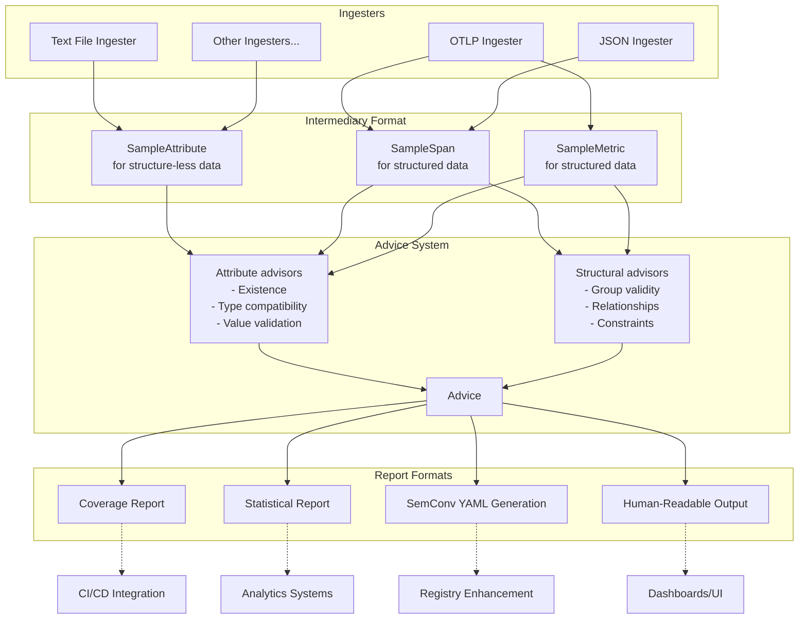

# Weaver Live Check

## 1. Overview

The weaver-live-check system provides a decoupled, flexible, extensible framework for checking sample telemetry. It transforms various input formats into standardized intermediary representations that can be assessed by advisors against expected patterns or values. The output results use the standard weaver templated process for full flexibility.



## 2. Architecture

### 2.1 Core Components

The weaver-live-check system comprises four main components:

1. **Ingesters**: Transform specific input formats into intermediary formats
2. **Intermediary Formats**: Standardized representations of telemetry data
3. **Advice System**: Compares intermediary data with expected patterns
4. **Report Formats**: Structured outputs for various downstream uses

### 2.2 Intermediary Formats

Intermediary formats are used for attributes and groups:

1. **SampleAttribute**

   - Used for structure-less or flat data
   - Contains attribute metadata with optional sample values
   - Supports basic attribute presence and value checks

2. **SampleSpan, SampleMetric, ...**
   - Used for fully structured telemetry data
   - Contains complete metadata e.g. Spans, Metrics, ...
   - Supports comprehensive structural and relationship validation

### 2.3 Data Flow

1. Input data is received by an appropriate ingester
2. The ingester transforms the input into its predetermined output format either attributes only or group types
3. The advice system runs appropriate comparisons on the intermediary format
4. Advice is collected into a list for each entity
5. Results are transformed into various report formats for different downstream uses (coverage reports, statistical analysis, YAML generation, human-readable output)

### 2.4 Advice system

Advisors implement a simple trait and are called during the live-check run. The design allows for simple and high-complexity advisors. For example, a simple deprecation checker or an LLM advisor.

For custom advice configurable by the user, Rego policies can be used. These custom policies override the out-of-the-box, default Rego policies providing advice aligned with the OpenTelemetry Semantic Conventions standard. For example, checking attribute names contain dot separated namespaces.

Here is a JSON output for an attribute level live-check:

```json
{
  "all_advice": [],
  "highest_advisory": null,
  "sample_attribute": {
    "name": "http.request.method",
    "type": "string",
    "value": "GET"
  }
}
{
  "all_advice": [
    {
      "advisory": "violation",
      "key": "type_mismatch",
      "message": "Type should be `int`",
      "value": "string"
    }
  ],
  "highest_advisory": "violation",
  "sample_attribute": {
    "name": "http.response.status_code",
    "type": "string",
    "value": "foo"
  }
}
{
  "all_advice": [
    {
      "advisory": "violation",
      "key": "missing_attribute",
      "message": "Does not exist in the registry",
      "value": "task.id"
    }
  ],
  "highest_advisory": "violation",
  "sample_attribute": {
    "name": "task.id",
    "type": null,
    "value": null
  }
}
{
  "all_advice": [
    {
      "advisory": "violation",
      "key": "missing_attribute",
      "message": "Does not exist in the registry",
      "value": "TaskId"
    },
    {
      "advisory": "improvement",
      "key": "missing_namespace",
      "message": "Does not have a namespace",
      "value": "TaskId"
    },
    {
      "advisory": "violation",
      "key": "invalid_format",
      "message": "Does not match name formatting rules",
      "value": "TaskId"
    }
  ],
  "highest_advisory": "violation",
  "sample_attribute": {
    "name": "TaskId",
    "type": null,
    "value": null
  }
}
{
  "all_advice": [
    {
      "advisory": "violation",
      "key": "missing_attribute",
      "message": "Does not exist in the registry",
      "value": "aws.s3.extension.name"
    },
    {
      "advisory": "information",
      "key": "extends_namespace",
      "message": "Extends existing namespace",
      "value": "aws.s3"
    }
  ],
  "highest_advisory": "violation",
  "sample_attribute": {
    "name": "aws.s3.extension.name",
    "type": "string",
    "value": "foo"
  }
}
{
  "advisory_counts": {
    "improvement": 1,
    "information": 1,
    "violation": 5
  },
  "highest_advisory_counts": {
    "violation": 4
  },
  "no_advice_count": 1,
  "total_advisories": 7,
  "total_attributes": 5
}
```

## 3. Usage Examples

Pipe a list of attribute names or name=value pairs to the `AttributeStdin` ingester.

```sh
cat attributes.txt | weaver registry live-check --ingester as
```

Or a redirect

```sh
weaver registry live-check --ingester as < attributes.txt
```

Or a here-doc

```sh
weaver registry live-check --ingester as << EOF
code.function
thing.blah
EOF
```

Or enter text at the prompt, an empty line will exit

```sh
weaver registry live-check --ingester as
code.line.number=42
```

Using `emit` for a round-trip test:

```sh
weaver registry live-check --ingester ao -r ../semantic-conventions/model --output ./outdir &
LIVE_CHECK_PID=$!
sleep 3
weaver registry emit -r ../semantic-conventions/model --skip-policies
kill -HUP $LIVE_CHECK_PID
wait $LIVE_CHECK_PID
```

Vendor example: Live check column names in a Honeycomb dataset

```sh
curl -s -X GET 'https://api.honeycomb.io/1/columns/{dataset}' -H 'X-Honeycomb-Team: {API_KEY}' \
| jq -r '.[].key_name' \
| weaver registry live-check --ingester as -r ../semantic-conventions/model
```

Receive OTLP requests and output advice as it arrives. Useful for debugging an application to check for telemetry problems as you step through your code. (ctrl-c to exit, or wait for the timeout)

```sh
weaver registry live-check --ingester ao -r ../semantic-conventions/model --inactivity-timeout 120
```

CI/CD - create a JSON report

```sh
weaver registry live-check --ingester ao -r ../semantic-conventions/model --format json --output ./outdir &
LIVE_CHECK_PID=$!
sleep 3
# Run the code under test here.
kill -HUP $LIVE_CHECK_PID
wait $LIVE_CHECK_PID
# Check the exit code and/or parse the JSON in outdir
```
