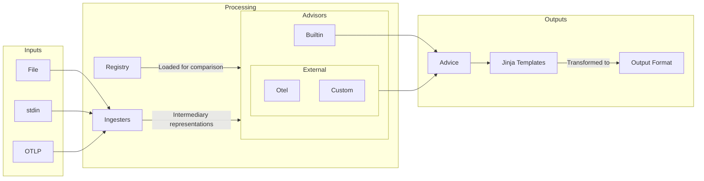

# Weaver Live Check

Live check is a developer tool for assessing sample telemetry and providing advice for improvement.

A Semantic Convention `Registry` is loaded for comparison with samples. `Ingesters` transform various input formats and sources into intermediary representations to be assessed by `Advisors`. The `Advice` produced is transformed via jinja templates to the required output format for downstream consumption.



## Ingesters

Sample data can have various levels of detail; from a simple list of attribute names, to a full OTLP signal structure. This data can come from different sources: files, stdin, OTLP. Therefore you need to choose the appropriate `Ingester` for your job by setting three parameters: `--input-source`, `--input-format`, `--advice-scope`

| Input Source   | Input Format | Advice Scope | Outcome                                                 |
| -------------- | ------------ | ------------ | ------------------------------------------------------- |
| &lt;file path> | `text`       | `attributes` | Text file with attribute names or name=value pairs      |
| `stdin`        | `text`       | `attributes` | Standard input with attribute names or name=value pairs |
| &lt;file path> | `json`       | `attributes` | JSON file with an array of attribute samples            |
| `stdin`        | `json`       | `attributes` | Standard input with JSON array of attribute samples     |
| `otlp`         | N/A          | `attributes` | OTLP signals with extracted attributes                  |

Some `Ingesters`, like `stdin` and `otlp`, can stream the input data so you receive output at the command line as it comes in. This is really useful in live debugging sessions allowing you to breakpoint, step through your code and see live assessment as the data is received in Weaver.

### OTLP

OTLP live-check is particularly useful in CI/CD pipelines to evaluate the quality of instrumentation observed from all unit tests, integration tests and so on.

This `Ingester` starts an OTLP listener and streams each received OTLP message to the `Advisors`. The currently supported stop conditions are: CTRL+C (SIGINT), SIGHUP, the HTTP /stop endpoint, and a maximum duration of no OTLP message reception. See the usage examples later in this document.

Options for OTLP ingest:

- `--otlp-grpc-address`: Address used by the gRPC OTLP listener
- `--otlp-grpc-port`: Port used by the gRPC OTLP listener
- `--admin-port`: Port used by the HTTP admin port (endpoints: /stop)
- `--inactivity-timeout`: Max inactivity time in seconds before stopping the listener

## Advisors

Sample entities are assessed by the set of `Advisors` to produce a list of `Advice` for each one. Built-ins check for fundamental compliance with the `Registry` supplied, for example `missing_attribute` and `type_mismatch`.

Beyond the fundamentals, external `Advisors` can be defined in Rego policies. The OpenTelemetry Semantic Conventions rules are included out-of-the-box by default. They provide `Advice` on name-spacing and formatting aligned with the standard. These default policies can be overridden at the command line with your own.

### Advice

As mentioned, a list of `Advice` is returned in the report for each sample entity. The snippet below shows `Advice` from two `Advisors`. A builtin is providing `missing_attribute` and a default Otel Rego policy is providing `extends_namespace`. The fields of `Advice` are intended to be used like so:

- `advice_level`: _string_ - one of `violation`, `improvement` or `information` with that order of precedence. Weaver will return with a non-zero exit-code if there is any `violation` in the report.
- `advice_type`: _string_ - a simple machine readable string to represent the advice type
- `message`: _string_ - a verbose string describing the advice
- `value`: _any_ - a pertinent entity associated with the advice

```json
{
  "all_advice": [
    {
      "advice_level": "violation",
      "advice_type": "missing_attribute",
      "message": "Does not exist in the registry",
      "value": "aws.s3.extension.name"
    },
    {
      "advice_level": "information",
      "advice_type": "extends_namespace",
      "message": "Extends existing namespace",
      "value": "aws.s3"
    }
  ],
  "highest_advice_level": "violation",
  "sample_attribute": {
    "name": "aws.s3.extension.name",
    "type": "string",
    "value": "foo"
  }
}
```

### Custom advisors

Use the `--advice-policies` command line option to provide a path to a directory containing Rego policies with the `live_check_advice` package name. Here's a very simple example that rejects any attribute name containing the string "test":

```rego
package live_check_advice

import rego.v1

# checks attribute name contains the word "test"
deny contains make_advice(advice_type, advice_level, value, message) if {
  contains(input.name, "test")
  advice_type := "contains_test"
  advice_level := "violation"
  value := input.name
  message := "Name must not contain 'test'"
}

make_advice(advice_type, advice_level, value, message) := {
  "type": "advice",
  "advice_type": advice_type,
  "advice_level": advice_level,
  "value": value,
  "message": message,
}
```

`input` contains the sample entity for assessment. `data` contains a structure derived from the supplied `Registry`. A jq preprocessor takes the `Registry` (and maps for attributes and templates) to produce the `data` for the policy. If the jq is simply `.` this will passthrough as-is. Preprocessing is used to improve Rego performance and to simplify policy definitions. With this model `data` is processed once whereas the Rego policy runs for every sample entity as it arrives in the stream. Preprocessing for the default otel policies lead to a ~10x speed-up.

To override the default Otel jq preprocessor provide a path to the jq file through the `--advice-preprocessor` option.

## Output

The output follows existing Weaver paradigms providing overridable jinja template based processing.

Out-of-the-box the output is streamed (when available) to templates providing `ansi` (default) or `json` output via the `--format` option. To override streaming and only produce a report when the input is closed, use `--stream false`. Streaming is automatically disabled if your `--output` is a path to a directory; by default, output is printed to stdout.

To provide your own custom templates use the `--templates` option.

As mentioned, the exit-code is set non-zero if any `violation` advice is provided in the output. This can be used in tests and/or CI to fail builds for example.

### Statistics

A statistics entity is produced when the input is closed like this snippet:

```json
{
  "advice_type_counts": {
    "extends_namespace": 2,
    "illegal_namespace": 1,
    "invalid_format": 1,
    "missing_attribute": 4,
    "missing_namespace": 1,
    "stability": 1,
    "type_mismatch": 1
  },
  "advice_level_counts": {
    "improvement": 2,
    "information": 2,
    "violation": 7
  },
  "highest_advice_level_counts": {
    "improvement": 1,
    "violation": 5
  },
  "no_advice_count": 1,
  "registry_coverage": 0.013138686306774616,
  "seen_non_registry_attributes": {
    "TaskId": 1,
    "http.request.extension": 1,
    ...
  },
  "seen_registry_attributes": {
    "android.app.state": 0,
    "android.os.api_level": 0,
    ...
  },
  "total_advisories": 11,
  "total_attributes": 7
}
```

These should be self-explanatory, but:

- `highest_advice_level_counts` is a per advice level count of the highest advice level given to each attribute
- `no_advice_count` is the number of attributes that received no advice
- `seen_registry_attributes` is a record of how many times each attribute in the registry was seen in the samples
- `seen_non_registry_attributes` is a record of how many times each non-registry attribute was seen in the samples
- `registry_coverage` is the fraction of seen registry attributes over the total registry attributes

This could be parsed for a more sophisticated way to determine pass/fail in CI for example.

## Usage examples

Pipe a list of attribute names or name=value pairs

```sh
cat attributes.txt | weaver registry live-check
```

Or a redirect

```sh
weaver registry live-check < attributes.txt
```

Or a here-doc

```sh
weaver registry live-check << EOF
code.function
thing.blah
EOF
```

Or enter text at the prompt, an empty line will exit

```sh
weaver registry live-check
code.line.number=42
```

Using `emit` for a round-trip test:

```sh
weaver registry live-check --input-source otlp -r ../semantic-conventions/model --output ./outdir &
LIVE_CHECK_PID=$!
sleep 3
weaver registry emit -r ../semantic-conventions/model --skip-policies
kill -HUP $LIVE_CHECK_PID
wait $LIVE_CHECK_PID
```

Vendor example: Live check column names in a Honeycomb dataset

```sh
curl -s -X GET 'https://api.honeycomb.io/1/columns/{dataset}' -H 'X-Honeycomb-Team: {API_KEY}' \
| jq -r '.[].key_name' \
| weaver registry live-check -r ../semantic-conventions/model
```

Receive OTLP requests and output advice as it arrives. Useful for debugging an application to check for telemetry problems as you step through your code. (ctrl-c to exit, or wait for the timeout)

```sh
weaver registry live-check --input-source otlp -r ../semantic-conventions/model --inactivity-timeout 120
```

CI/CD - create a JSON report

```sh
weaver registry live-check --input-source otlp -r ../semantic-conventions/model --format json --output ./outdir &
LIVE_CHECK_PID=$!
sleep 3
# Run the code under test here.
kill -HUP $LIVE_CHECK_PID
wait $LIVE_CHECK_PID
# Check the exit code and/or parse the JSON in outdir
```
