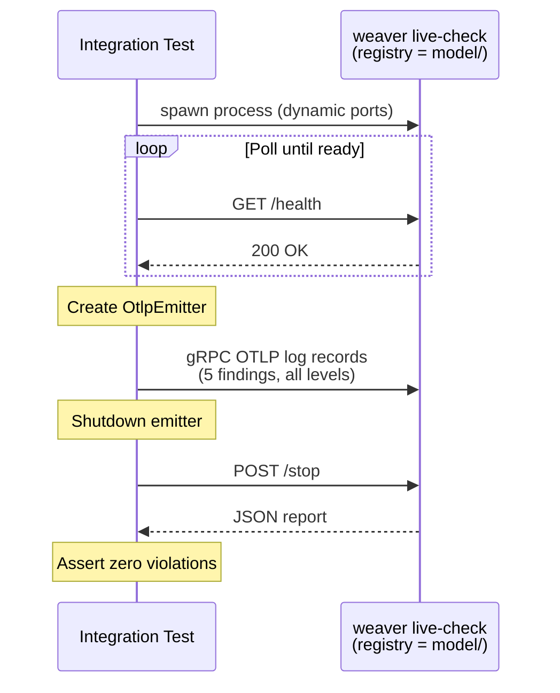

# Dog-fooding: Live-check Generates Its Own Code and Docs, and Live-checks Itself

Weaver Live-check uses Weaver's own semantic convention model format and template engine to define the `finding` schema, generate Rust types and constants, and generate reference documentation. An integration test validates the emitted OTLP log records against the model, catching any drift between the generated code and the schema.

## Model

The finding attributes, enumerations, and event are defined as a semantic convention registry
in [`../model/`](../model/):

- **`live_check.yaml`** — Defines the `weaver.finding.*` attributes (including enum types for
  `id`, `level`, `sample_type`, and `signal_type`), template types for `context` and
  `resource_attribute`, and the `weaver.live_check.finding` event.
- **`registry_manifest.yaml`** — Registry manifest declaring the `weaver-live-check` registry
  and its dependency on the upstream OpenTelemetry semantic conventions.

The model uses the version 2 schema format.

## Templates

### Markdown documentation

Weaver Minijinja templates at [`../templates/markdown/`](../templates/markdown/)
generate Markdown documentation from the resolved registry:

- **`weaver.yaml`** — Template configuration: single-file output using `filter: .` to pass the
  full resolved registry as context.
- **`live_check_doc.md.j2`** — Main template producing the event overview, attribute summary
  table, and per-attribute detail sections with inline enum value tables and template type info.
- **`macros.j2`** — Reusable macro library for stability badges, attribute tables, enum member
  tables, type display, and example formatting.

### Rust code generation

Minijinja templates at [`../templates/rust/`](../templates/rust/) generate all
finding-related Rust types, constants, entity structs, and log record builders from the model:

- **`weaver.yaml`** — Template configuration: three single-file outputs producing
  `generated/attributes.rs`, `generated/events.rs`, and `generated/entities.rs`.
- **`macros.j2`** — Shared macro library for attribute constants, Rust type mapping,
  enum definitions, and doc comments.
- **`attributes.rs.j2`** — Iterates all `weaver.finding.*` attributes and generates:
  - **Attribute name constants** for every attribute (e.g., `WEAVER_FINDING_ID`,
    `WEAVER_FINDING_SAMPLE_TYPE`).
  - **Rust enums** for each attribute with enum members (`FindingId`, `FindingLevel`,
    `SampleType`, `SignalType`). Extensible enums (annotated with `custom_variants: true`
    in the model) get a `Custom(String)` catch-all variant; closed enums derive `Copy`.
- **`events.rs.j2`** — Iterates all events and generates:
  - **Event name constants** (e.g., `WEAVER_LIVE_CHECK_FINDING`).
  - **`populate_*_log_record` functions** that accept a `&mut impl LogRecord` and set the
    event name, severity, body, and all attributes. Parameters use the generated enum types
    for type safety. Template-type attributes accept `&[(Key, AnyValue)]` slices with
    suffix keys that get prefixed with the attribute's namespace constant.
- **`entities.rs.j2`** — Iterates all imported entities (e.g., `service`, `telemetry.sdk`)
  and generates:
  - **Attribute key constants** for each entity attribute.
  - **Rust structs** with identity fields (required) and description fields (optional).
  - **`to_resource_attributes()`** methods that convert the struct to `Vec<KeyValue>`.
  - **Rust enums** for any entity attributes with enum members (e.g., `SdkLanguage`).

## Generating

From the repository root:

### Documentation

```sh
cargo run -- registry generate \
  --registry crates/weaver_live_check/model/ \
  --templates crates/weaver_live_check/templates/ \
  --v2 \
  markdown \
  crates/weaver_live_check/docs/
```

This produces [`finding.md`](finding.md).

### Rust code

```sh
cargo run -- registry generate \
  --registry crates/weaver_live_check/model/ \
  --templates crates/weaver_live_check/templates/ \
  --v2 \
  rust \
  crates/weaver_live_check/src/
```

This produces [`../src/generated/attributes.rs`](../src/generated/attributes.rs),
[`../src/generated/events.rs`](../src/generated/events.rs), and
[`../src/generated/entities.rs`](../src/generated/entities.rs).

## How It Works

1. The `registry generate` command loads the model from `live_check.yaml` and resolves it
   against the registry manifest (including the OTel dependency).
2. The `--v2` flag produces the v2 registry structure where attributes are accessed via
   `ctx.registry.attributes`, events via `ctx.registry.events`, and entities via
   `ctx.registry.entities`.
3. The `filter: .` in `weaver.yaml` passes the entire resolved registry as the template context.
4. `attributes.rs.j2` iterates over all attributes, generating constants for each one and
   enums for those with `type.members`. It derives enum names from the attribute key structure
   and detects extensible enums from model annotations.
5. `events.rs.j2` iterates over all events, generating event name constants and type-safe
   `populate_*_log_record` functions that set the event name, severity, body, and all
   attributes on a `LogRecord`.
6. `entities.rs.j2` iterates over all imported entities (from the `imports.entities` list in
   the model), generating structs with identity/description fields, attribute key constants,
   `to_resource_attributes()` methods, and any associated enums.
7. The generated modules provide `FindingId`, `SampleType`, `SignalType` enums,
   `WEAVER_FINDING_*` constants, log record builders, and entity structs (`Service`,
   `TelemetrySdk`) — replacing hand-written definitions and eliminating hardcoded string
   literals throughout the crate.

## Integration Test: OTLP Emission Validation

The integration test at [`../tests/livecheck_emit.rs`](../tests/livecheck_emit.rs) closes the
dog-fooding loop by validating that the OTLP log records emitted by `OtlpEmitter` conform to
the live_check model.



The test:

1. Spawns `weaver registry live-check` with `--output http` and dynamic ports
2. Polls `/health` until the server is ready
3. Creates an `OtlpEmitter` and emits 5 diverse findings covering all severity levels,
   multiple sample types (span, metric, attribute), complex context JSON, and resource
   attributes on parent signals
4. Collects the JSON report via `POST /stop`
5. Asserts `total_entities > 0` (data flowed through) and zero violations from
   `statistics.advice_level_counts`

If a template or model change breaks the OTLP emission format, this test catches it
immediately — any violations are printed with their messages for fast debugging. The coverage statistic is also checked to ensure all attributes and events are represented in the emitted findings, preventing silent drift between the model and the emitted data.
