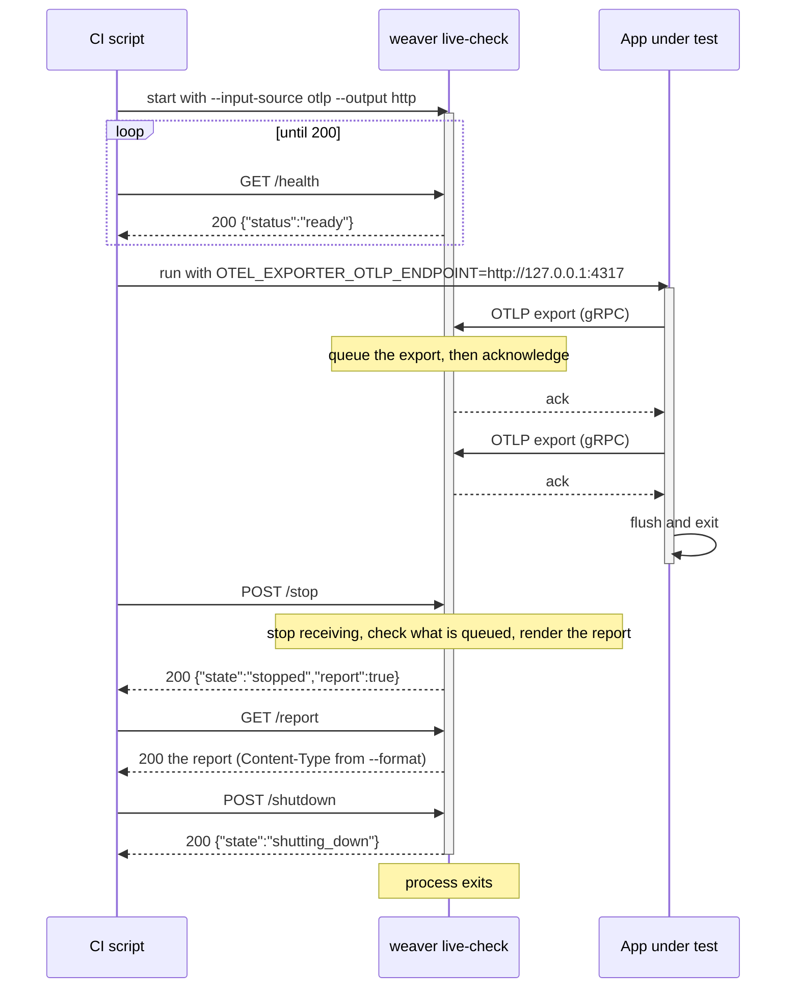

# Driving live-check over HTTP

`weaver registry live-check --input-source otlp` listens for OTLP and checks what it
receives. In CI you usually want another process to control it: start weaver, run the
code under test, then collect the report. The admin port is for that. It serves four
endpoints, and with `--output=http` the report comes back over the same port.

## The sequence



Three things make this safe:

- An export is acknowledged only after it is queued for checking. When the app's
  exporter flushes and returns, its data is ahead of any later `/stop`.
- `/stop` returns only when the report is ready. There is nothing to poll for.
- The report is read while the process is fully alive. Exiting is a separate request, so
  a large report is never cut off, however slowly the client reads it.

## The endpoints

| Method | Path | Returns |
| --- | --- | --- |
| `GET` | `/health` | `200 {"status":"ready"}` once the listener is up. |
| `POST` | `/stop` | Stops receiving and waits for the report. `200 {"state":"stopped","report":true\|false}`. `report` is `true` with `--output=http`. Calling it again returns the same. |
| `GET` | `/report` | The report, with `--output=http`. `409` while still receiving, or once the process is shutting down. |
| `POST` | `/shutdown` | `200 {"state":"shutting_down"}`, then the process exits. Stops the run first if it is still receiving. |

Weaver logs each of these requests to stderr as it handles them.

## A shell script

```bash
#!/usr/bin/env bash
set -euo pipefail

weaver registry live-check -r model --input-source otlp \
  --otlp-grpc-port 4317 --admin-port 4320 \
  --format json --output http &
weaver_pid=$!

until curl -fsS http://127.0.0.1:4320/health >/dev/null 2>&1; do sleep 0.5; done

OTEL_EXPORTER_OTLP_ENDPOINT=http://127.0.0.1:4317 ./run-my-tests

curl -fsS -X POST http://127.0.0.1:4320/stop
curl -fsS http://127.0.0.1:4320/report -o report.json
curl -fsS -X POST http://127.0.0.1:4320/shutdown
wait "$weaver_pid"
```

The [`weaver-live-check-start`](../../../.github/actions/weaver-live-check-start/) and
[`weaver-live-check-stop`](../../../.github/actions/weaver-live-check-stop/) GitHub actions
do the same and also grade the report.

## Who stops what

With `--output=http` the client owns the run. Weaver never stops or exits on its own:

- `--inactivity-timeout` is ignored, with a warning if it was set. A quiet stretch in your
  tests cannot end the run before you call `/stop`.
- After `/stop`, weaver waits for `/shutdown` for as long as it takes.
- A signal (`SIGINT` or `SIGHUP`) still stops the run, and a second signal ends the process.
  The report is only ever served from `/report`. If the process exits before anyone reads
  it, the report is gone.

Without `--output=http` the report goes to stdout or `--output <dir>`, and one call is
enough: `/stop` ends the run, the report is written, and the process exits by itself.
Inactivity and signals work as usual.

## Ports

`--otlp-grpc-port` and `--admin-port` must differ. Either may be `0` to pick a free port;
the startup log prints the bound addresses. Both bind to `--otlp-grpc-address`, which
defaults to the loopback interface.
