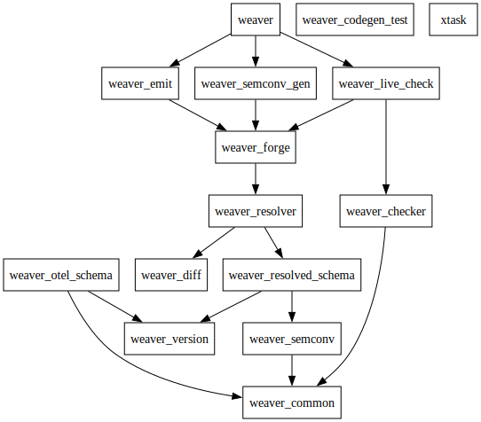

# Architecture (WIP)

## Architecture Overview

The OpenTelemetry Weaver tool is architecturally designed as a platform. By default, this
tool incorporates a template engine that facilitates documentation and Client SDK/API
generation across various programming languages. In the future, we plan to integrate a
WASM plugin system, allowing the community to enhance the platform. This would
pave the way for features like enterprise data catalog integration, privacy policy enforcement,
documentation generation, dashboard creation, and more.

Below is a diagram detailing the primary components of the OpenTelemetry Weaver tool.

## Crates Layout

This project utilizes the concept of a cargo workspace to organize the
libraries developed for the OTel Weaver project. The set of crates in the
workspace is grouped under the directory `crates/*`. Adding a crate under this
directory will automatically include it in the OTel Weaver project due to the
directive `members = [ "crates/*" ]` included in the main `Cargo.toml` under the
`[workspace]` section.

This project has not been published to crates.io and will not be until it is
ready for production use.

Every crate in the workspace must have a `README.md` file that describes the
purpose of the crate and how to use it. Furthermore, the name of each crate
must be prefixed with `weaver_` to avoid any conflicts with existing crates on
crates.io.

The following is a list of crates in the workspace, along with a brief
description and the current status of each crate:

| Crate                                                              | Description                                                          | Status           |
|--------------------------------------------------------------------|----------------------------------------------------------------------|------------------|
| [weaver_semconv](/crates/weaver_semconv/README.md)                 | Semantic Convention Registry Data Model                              | Alpha            |
| [weaver_version](/crates/weaver_version/README.md)                 | OpenTelemetry Schema Versioning Data Model                           | Alpha            |
| [weaver_logger](/crates/weaver_logger/README.md)                   | Generic logger supported colorized output                            | Alpha            |
| [weaver_forge](/crates/weaver_forge/README.md)                     | Template engine used to generate artifacts from any serde json value | Alpha            |
| [weaver_diff](/crates/weaver_diff/README.md)                       | Diffing tool to compare two versions of a text (used in unit tests)  | Alpha            |
| [weaver_resolved_schema](/crates/weaver_resolved_schema/README.md) | Resolved Schema Data Model                                           | Work-In-Progress |
| [weaver_schema](/crates/weaver_schema/README.md)                   | Telemetry Schema Data Model                                          | Work-In-Progress |
| [weaver_resolver](/crates/weaver_resolver/README.md)               | Telemetry Schema Resolution Process + Lineage                        | Work-In-Progress |
| [weaver_cache](/crates/weaver_cache/README.md)                     | Telemetry Schema and Semantic Convention Registry Cache              | Work-In-Progress |
| [weaver_checker](/crates/weaver_checker/README.md)                 | Policy engine to enforce policies on telemetry data                  | Work-In-Progress |
|                                                                    |                                                                      |                  |
| xtask                                                              | Set of tasks to validate the project                                 | Done             |

Note 1: Alpha status means that the crate is in a usable state but may have
limited functionality and/or may not be fully tested.

Note 2: Work-In-Progress status means that the crate is still under active
development.