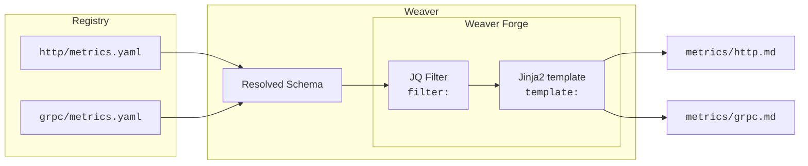

# Code Generation

<kbd>weaver registry generate</kbd>

|Quick Links | [weaver.yaml](weaver-config.md) | [Semconv Schema](../schemas/semconv-syntax.md) | [JQ Filters](../crates/weaver_forge/README.md#jq-filters-reference) | [Jinja Filters](../crates/weaver_forge/README.md#jinja-filters-reference) |
|-|-|-|-|-|

A core element of schema-first telemetry are the artifacts it enables:
- **Up-to-Date Documentation**: Created right from the schema, the source of truth. When a metric changes, the docs do so, too.
- **Type-safe Constructors**: `New*` functions for **_your_** telemetry that **always** create schema-conforming results.
- etc.

>[!Note]
>Weaver enables this using code-generation, powered by [minijinja](https://github.com/mitsuhiko/minijinja) (Jinja2-compatible templating) and [jaq](https://github.com/01mf02/jaq) (jq-compatible data processing).  
>Full documentation is available at [Weaver Forge](../crates/weaver_forge/README.md)

## Learning Jinja Templates

If you're new to Jinja or need a refresher, these resources will help you get started:

- **[Official Jinja Template Documentation](https://jinja.palletsprojects.com/en/stable/templates)** - Comprehensive reference for Jinja template syntax
- **[Jinja2 Tutorial - Loops and Conditionals](https://ttl255.com/jinja2-tutorial-part-2-loops-and-conditionals/)** - Practical tutorial with examples
- **[MiniJinja Documentation](https://docs.rs/minijinja/latest/minijinja/)** - Rust implementation used by Weaver (mostly compatible with Jinja2)

Weaver extends Jinja with custom filters and functions specifically designed for semantic convention generation. See the [Jinja Filters Reference](../crates/weaver_forge/README.md#jinja-filters-reference) for details.

## High-level overview

>[!Tip]
>For a full tutorial, consider the [Step-by-Step Guide](../crates/weaver_forge/README.md#step-by-step-guide)

Let's say we want to generate Markdown documentation for the metrics of our application or convention.
With Weaver Forge, the following directory layout is used by default:

| Path | Description |
|-|-|
| | |
| `registry/http/` | Some [registry](registry.md) that defines telemetry. In this case for HTTP |
| `registry/http/metrics.yaml` | Schema file for some HTTP metrics |
| `registry/grpc/` | Another registry that defines telemetry for a different use-case. |
| `registry/grpc/metrics.yaml` | Schema file for some gRPC metrics |
| | |
| `templates/registry/md` |  |
| `templates/registry/md/weaver.yaml` | Weaver (Forge) [configuration](weaver-config.md): Specifies templates to use, their input values, output path and various other transformations. |
| `templates/registry/md/metrics.md.j2` | Jinja2-style template that operates on the resolved schema and evaluates into the desired `metrics.md` file |

The most important files are `weaver.yaml` and the `*.j2` templates.

```yaml
# weaver.yaml
templates:
- template: "metrics.md.j2"
  filter: semconv_grouped_metrics
  application_mode: each
  file_name: "metrics/{{ctx.root_namespace | snake_case}}.md"
```

The markdown template could look like this:

````jinja2
{#
  Copyright The OpenTelemetry Authors
  SPDX-License-Identifier: Apache-2.0
  This file is:
  - a Jinja template,
  - used to generate semantic conventions,
  - using weaver.
  For doc on the template syntax:
  https://jinja.palletsprojects.com/en/3.0.x/
  For doc on the semantic conventions:
  https://github.com/open-telemetry/semantic-conventions
  For doc on weaver:
  https://github.com/open-telemetry/weaver
#}
## {{ctx.root_namespace}}

### {{m.metric_name}}

```promql
# TYPE {{m.metric_name}} {{m.instrument | upper}}
{{m.metric_name + "{"}}{{m.attributes | map(attribute='name') | join(", ") + "}"}}
```

{{m.brief}}


|Attribute|Type|Description|
|-|-|-|

| {{attr.name}} | {{ attr.type }}| {{attr.brief}} |





````

When calling `weaver registry generate md`, the following happens:



Weaver resolves the entire registry (http and grpc in this case) into a single document. This is passed to the [JQ filter](../crates/weaver_forge/README.md#jq-filters) `semconv_grouped_metrics`. This groups individual metrics by their root namespace (`http` or `grpc`)

This output in turn is passed to the `metrics.md.j2` template, evaluated by the [minijinja](https://github.com/mitsuhiko/minijinja) templating engine. Because `application_mode` is set to `each`, the template is invoked for each group, so this yields a `http.md` and a separate `grpc.md`.

## Understanding Filters

The `filter` field in `weaver.yaml` is a powerful feature that preprocesses your schema data before it reaches your templates. Think of filters as data transformations that shape how your templates receive information.

### Default Behavior (No Filter)

When you **don't specify a filter**, the entire resolved registry is passed directly to your template in the `ctx` variable:

```yaml
templates:
  - template: "all_data.j2"
    application_mode: single
    # No filter specified - ctx contains the entire registry
```

Your template receives everything:
```jinja
{# ctx.groups contains all semantic convention groups #}

  {{ group.id }}

```

### With a Filter

When you **do specify a filter**, it transforms the data before passing it to the template. Filters use JQ expressions to select and transform data:

```yaml
templates:
  - template: "metrics.md.j2"
    filter: '.groups | map(select(.type == "metric"))'  # Select only metric groups
    application_mode: each
```

Now `ctx` contains the output of the filter - each metric group object:
```jinja
{# ctx is a single metric group #}
## {{ ctx.id }}
{{ ctx.brief }}

  - {{ attr.name }}

```

### Common Helper Filters

For convenience, Weaver provides pre-built helper filters for common operations:

- **`semconv_grouped_attributes`** - Groups attributes by root namespace (e.g., `http`, `db`)
- **`semconv_grouped_metrics`** - Groups metrics by root namespace
- **`semconv_grouped_events`** - Groups events by root namespace

### Filter Options

Many filters accept options to customize their behavior:

```yaml
templates:
  - template: "stable_attrs.j2"
    filter: >
      semconv_grouped_attributes({
        "stable_only": true,
        "exclude_deprecated": true,
        "exclude_root_namespace": ["url", "network"]
      })
    application_mode: each
```

**Options explained:**
- `stable_only: true` - Only include stable attributes
- `exclude_deprecated: true` - Skip deprecated attributes  
- `exclude_root_namespace` - Exclude specific namespaces

### The `ctx` Variable

The `ctx` variable is the primary way your template accesses data:

- **Without a filter**: `ctx` = the entire resolved registry
- **With `application_mode: single`**: `ctx` = the filter's complete output
- **With `application_mode: each`**: `ctx` = one element from the filter's output array

For more details on available filters, see the [JQ Filters Reference](../crates/weaver_forge/README.md#jq-filters-reference).


## Tips and Tricks

#### Use `debug()`

Jinja2 can be overwhelming and hard to discover. Try putting `debug()` somewhere in your code:

```
/*
{{ debug() }}
*/
```

This gives you a JSON-like dump of every exact variable and corresponding value, identifier, function, filter, test, etc.

## Built-in Helper Functions and Filters

Weaver provides numerous built-in filters and functions to simplify template development. Here are the most commonly used ones:

### Case Conversion Filters

Transform strings between different naming conventions:

- `kebab_case` - Converts to kebab-case: `{{ "Hello World" | kebab_case }}` → `hello-world`
- `snake_case` - Converts to snake_case: `{{ "Hello World" | snake_case }}` → `hello_world`  
- `pascal_case` - Converts to PascalCase: `{{ "hello_world" | pascal_case }}` → `HelloWorld`
- `camel_case` - Converts to camelCase: `{{ "hello_world" | camel_case }}` → `helloWorld`
- `screaming_snake_case` - Converts to SCREAMING_SNAKE_CASE
- `screaming_kebab_case` - Converts to SCREAMING-KEBAB-CASE
- `upper_case`, `lower_case`, `title_case` - Standard case conversions
- `capitalize_first` - Capitalizes only the first character

**Example:**
```jinja
file_name: "{{ctx.root_namespace | snake_case}}.md"
```

### Other Useful Filters

- `comment` - Format text as comments (language-specific, configured in weaver.yaml)
- `attribute_sort` - Sort attributes by requirement level, then name
- `required` / `not_required` - Filter attributes by requirement level
- `flatten` - Convert nested lists into a single list
- `map_text` - Map values using text_maps in weaver.yaml

For a complete list of all filters, functions, and tests, see:
- **[Jinja Filters Reference](../crates/weaver_forge/README.md#jinja-filters-reference)** - Complete filter documentation
- **[Jinja Functions Reference](../crates/weaver_forge/README.md#jinja-functions-reference)** - Available functions
- **[Source Code](../../crates/weaver_forge/src/extensions)** - Implementation details
