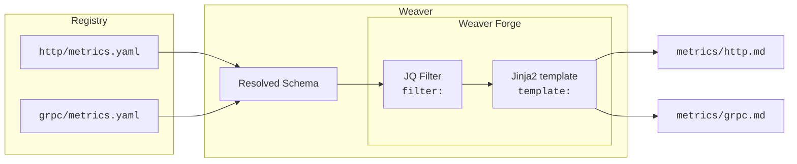

# Code Generation

<kbd>weaver registry generate</kbd>

|Quick Links | [weaver.yaml](weaver-config.md) | [JQ](/crates/weaver_forge/README.md#jq-filters-reference) | [Jinja](/crates/weaver_forge/README.md#jinja-filters-reference) |
|-|-|-|-|

A core element of schema-first telemetry are the artifacts it enables:
- **Up-to-Date Documentation**: Created right from the schema, the source of truth. When a metric changes, the docs do so, too.
- **Type-safe Constructors**: `New*` functions for **_your_** telemetry that **always** create schema-conforming results.
- etc.

>[!Note]
>Weaver enables this using code-generation, powered by [minijinja](https://github.com/mitsuhiko/minijinja) and [jaq](https://github.com/01mf02/jaq).  
>Full documentation is available at [Weaver Forge](/crates/weaver_forge/README.md)

## High-level overview

>[!Tip]
>For a full tutorial, consider the [Step-by-Step Guide](/crates/weaver_forge/README.md#step-by-step-guide)

Let's say we want to generate Markdown documentation for the metrics of our application or convention.
With Weaver Forge, the following directory layout is used by default:

| Path | Description |
|-|-|
| | |
| `registry/http/` | Some [registry](registry.md) that defines telemetry. In this case for HTTP |
| `registry/http/metrics.yaml` | Schema file for some HTTP metrics |
| `registry/grpc/` | Another registry that defines telemetry for a different use-case. |
| `registry/grpc/metrics.yaml` | Schema file for some gRPC metrics |
| | |
| `templates/registry/md` |  |
| `templates/registry/md/weaver.yaml` | Weaver (Forge) [configuration](weaver-config.md): Specifies templates to use, their input values, output path and various other transformations. |
| `templates/registry/md/metrics.md.j2` | Jinja2-style template that operates on the resolved schema and evaluates into the desired `metrics.md` file |

The most important files are `weaver.yaml` and the `*.j2` templates.

```yaml
# weaver.yaml
templates:
- template: "metrics.md.j2"
  filter: semconv_grouped_metrics
  application_mode: each
  file_name: "metrics/{{ctx.root_namespace | snake_case}}.md"
```

The markdown template could look like this:

````jinja2
## {{ctx.root_namespace}}

### {{m.metric_name}}

```promql
# TYPE {{m.metric_name}} {{m.instrument | upper}}
{{m.metric_name + "{"}}{{m.attributes | map(attribute='name') | join(", ") + "}"}}
```

{{m.brief}}


|Attribute|Type|Description|
|-|-|-|

| {{attr.name}} | {{ attr.type }}| {{attr.brief}} |





````

When calling `weaver registry generate md`, the following happens:



Weaver resolves the entire registry (http and grpc in this case) into a single document. This is passed to the [JQ filter](/crates/weaver_forge/README.md#jq-filters) `semconv_grouped_metrics`. This groups individual metrics by their root namespace (`http` or `grpc`)

This output in turn is passed to the `metrics.md.j2` template, evaluated by the [minijinja](https://github.com/mitsuhiko/minijinja) templating engine. Because `application_mode` is set to `each`, the template is invoked for each group, so this yields a `http.md` and a separate `grpc.md`.


## Tips and Tricks

#### Mark generated files

Add a short header comment in each template output noting that the file is generated and which template produced it. This helps downstream users avoid hand-editing generated artifacts and makes it easier to trace changes back to the source template.

#### Use `debug()`

Jinja2 can be overwhelming and hard to discover. Try putting `debug()` somewhere in your code:

```
/*
{{ debug() }}
*/
```

This gives you a JSON-like dump of every exact variable and corresponding value, identifier, function, filter, test, etc.
