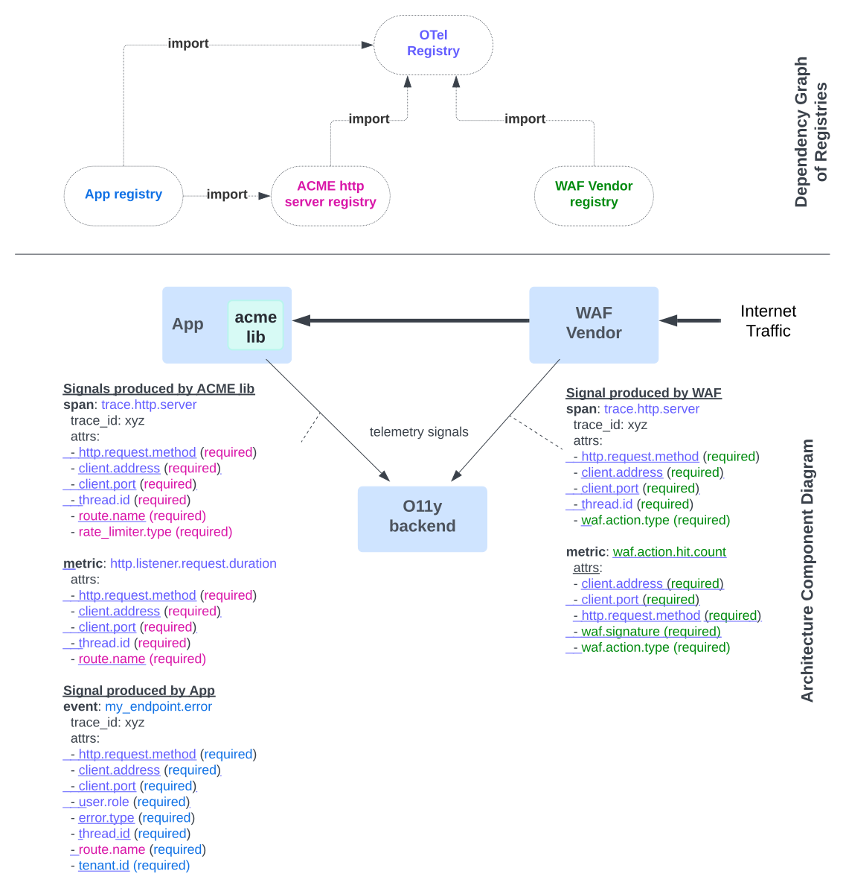

# Multi-Registry - Proposal

Status: Work in Progress

## Introduction 

A series of changes are proposed to support multiple semantic convention registries in OpenTelemetry.

> Note 1: This proposal aims to describe the overall changes needed to realize the multi-registry long term vision.
> However, this does not mean that we cannot introduce the changes incrementally. For example, we could start
> by supporting attributes only and then progressively add support for metrics, events, spans, etc.

> Note 2: In this document, the term "semantic convention registry" refers to the collection of semantic
> conventions (attributes, groups, etc.) that define the semantics of the data model used in OpenTelemetry.
> The term "registry" is used interchangeably with "semantic convention registry".

> Note 3: In this document, the term "OTEL" refers to the OpenTelemetry project.

## Use Case Example

The following use case is not intended to be exhaustive, but it should provide a good idea of the
types of multi-registry scenarios we aim to support.

The diagram below illustrates a small but realistic example of how multiple registries could be used together.
For more details, the YAML semantic convention files corresponding to the diagram are available in this
[folder](registries).

The color-coding within the signal descriptions indicates the provenance of the corresponding definition.

**Actors and Their Benefits** 

1. **OTEL:**
  - **Value Proposition:**
    - OTEL can focus on defining core signals while delegating the creation of more specific signals
      to the community at scale.
    - OTEL establishes the foundation for developing new uses and tools in the observability ecosystem (e.g. data
      catalog integration, dashboard generation, database schema generation, metadata to improve AI assisted Query
      engines, etc.). 

2. **Vendor:**
  - **Value Proposition:**
    - By publishing their own registry, vendors make it easier for their customers
      to discover and effectively use custom signals specific to their products.
    - Vendors can reuse common signals defined by OTEL, ensuring consistency in customer experiences. This
      strategy enhances the interoperability of their products within the larger observability ecosystem.

3. **OSS Library Author:**
  - **Value Proposition:**
    - The OSS library author can reuse OTEL-defined attributes and signals, integrating them with custom
      signals tailored to their library.
    - Publishing a registry for the library simplifies the integration process for
      developers, making it easier to adopt and use the library in a consistent and standardized way.
    - This approach also increases the attractiveness, visibility and usability of the library within
      the community.

4. **Enterprise Application:**
  - **Value Proposition:**
    - Enterprises can leverage the concept of registries to import external registries and simplify their observability
      integration for complex systems.
    - By creating internal registries, enterprises can define custom signals that align with their specific
      needs and share these across teams and products, fostering internal consistency. This capability enhances
      collaboration and streamlines the observability practices within the organization.

By supporting these actors and their specific use cases, the multi-registry approach enables a flexible,
community-driven model for defining and using semantic conventions across diverse domains and applications.

## Design Principles

- **Independent Ownership**: Individuals or organizations should be able to create and maintain a registry
  independently, without requiring coordination with the OTEL project.
- **Registry Accessibility**: Registries should be either private or public, allowing flexibility based on
  the needs of the owner. Registries should be accessible via a URL.
- **Common Format**: A published registry should adhere to a common format, making it easy to consume and
  integrate with other registries.
- **Self-Contained**: A published registry should be self-contained and stored in a single file.
- **Community Support Tools**: The OTEL project should provide and maintain an extensible tool, Weaver, to
  assist the community in creating, validating, resolving, and publishing registries. Weaver should also
  support documentation generation and code generation for any registry.
- **Core Policy Enforcement**: The OTEL project should establish and enforce a set of core policies (e.g.,
  backward compatibility policies) that all registries must adhere to, ensuring consistency and reliability.
  These policies should be enforced by Weaver.
- **Cross-Registry References**: References between different registries should be supported, facilitating
  interoperability and integration across various registries.
- **Conflict Avoidance through Scoping**: A scoping mechanism should be implemented to ensure that a signal
  or an attribute name does not conflict with future declarations in other registries. Every imported
  registry should be scoped with a unique alias to avoid conflicts.
- **Circular Reference Handling**: Circular references between registries should be detected, reported, and
  rejected to prevent conflicts and maintain the integrity of the system.

## Semantic Convention Registry Changes

With the following changes, a registry can be defined by anyone, without requiring any human coordination with OTEL.
Registry authors can extend or amend entities defined in other registries or create their own attributes
and groups.

Changes:
- A registry can import one or several semantic conventions from other published registries.
- A published registry is a resolved registry (see resolved registry format below) accessible via a URL.
- A new optional section called `imports` will be added to the semantic convention file defining groups. The `imports`
  section is a list of imported semantic conventions with their schema URLs and aliases.
- Aliases defined in a file with `global_imports` section are global aliases and are visible in all the
  files of the registry otherwise aliases are local to a file (see discussion
  [here](#do-we-allow-an-alias-defined-in-one-semconv-file-to-be-visible-in-another-semconv-file)). Note that these
  files can not contain any group definitions.
- Only one alias is allowed for a specific `schema_url` across all the files of a registry (see discussion 
  [here](#do-we-allow-importing-the-same-external-registry-with-different-aliases-within-the-scope-of-a-registry-)).
- Only one version of a specific imported registry is allowed across all the files of a registry (see discussion
  [here](#do-we-allow-importing-the-same-registry-with-different-versions)). 
- Schema URLs are used to fetch both OTEL schema and self-contained/resolved registries.
  The way a resolved registry is linked to an OTEL schema is TBD (it could be a new URL pointing to the resolved
  registry or an integration within the schema file itself).
- Import a registry and not using it is considered an error.
- A registry can only be imported as a self-contained/resolved registry.
- Any registry must comply with the OTEL core policies to ensure backward compatibility and consistency across
  registries (see section [Core Policies](#core-policies)).
- Any stable attribute or group in a registry is a referencable entity when the registry is imported.
- Experimental entities in a registry can not be referenced into other registries (see discussion
  [here](#do-we-allow-reference-of-experimental-entities-across-registries)).
- Group references are now supported to extend or overrides group fields and attributes of an imported group. (see
  discussion [here](#do-we-allow-references-to-groups-or-attributes-defined-in-an-imported-registry)).
- A registry 'A' can import semantic conventions from a registry 'B'. 'A' can override some entities of 'B'. These
  overrides are not propagates to 'B'. 'B' can not import the registry 'A' (circular dependencies are not allowed).
- A group reference cannot change the type of the imported group (similar to attribute references).
- References to an imported group or attribute are always prefixed with the alias of the imported semantic
  convention (e.g., `ref: otel:client.address`). The colon is used as a separator between the alias and the
  group or attribute name. If preferred, there is an alternative to make the alias optional, see the alternatives
  section below.
- References to entities (groups or attributes) defined in the local registry are never prefixed.
- A locally defined group can reference an imported group in its `extends` section.
- A locally defined group can reference an imported attribute in its `attributes` section.

> Wonkiness to remove from the existing semantic convention schema:
> 
> - Rename `metric_name` to `name` in the `metric` group for consistency with other groups.
> - Probably more TBD.

Things to avoid/minimize:

- **Name squatting**: By relying on local aliases and URL schema, we reduce the risk of name squatting, as
  the naming convention is not based on company names that are not necessarily unique and are complex to control.
- **Name inconsistency**: By enforcing core policies, we minimize the risk of name inconsistency across registries.

Alternatives:

- We could make aliases optional in the imports section. To do so, we would need to rely on Weaver to automatically
  detect entity IDs that are defined both in the local semantic convention file and the imported registry. When such
  a conflict is detected, Weaver will report an error and ask the user to define an alias for the imported registry.
  This approach could be supported in the future if the need arises.

### Discussions

#### Do we allow importing the same external registry with different aliases within the scope of a registry?
- Short answer: No for consistency and readability.
- Long answer: Although technically it is not a problem, it is a good practice to use the same alias for the same
  registry inside the same file or across different files of the same registry. This practice makes the overall
  registry more readable and maintainable. Weaver will report an error if different aliases are used for the same
  registry in the scope of a single registry.

#### Do we allow an alias defined in one semconv file to be visible in another semconv file?
- Short answer: Yes, under certain conditions.
- Long answer: An alias defined in a file containing `global_imports` section is visible in all the files of the
  registry. Such an alias is called a global alias. A global alias is useful when the same imported registry is
  used in multiple files within the same registry. In this situation, defining a global alias simplifies the
  management of dependencies, as updating to a new registry version will only require a single change in the
  registry file containing the global aliases. Weaver will report an error if an alias not defined locally or as
  a global alias is used in a semconv file.

#### Do we allow importing the same registry with different versions?
- Short answer: No for consistency.
- Long answer: Although technically it is possible to support multiple versions of an imported registry, it is a
  good practice to align the versions inside the same registry. This practice make the overall registry more
  consistent and easy to reason about. Weaver will report an error if different versions are used for the same
  registry in the scope of a single registry.

#### Do we allow reference of experimental entities across registries?
- Short answer: No for backward compatibility.
- Long answer: Experimental entities are not meant to be used in production. Experimental entities are subject to
  change or removal without any notice in the next version of the registry. The type of an experimental entity can
  be changed. Weaver will detect and report an error if an experimental entity is referenced across registries.

#### Do we allow circular references between registries?
- Short answer: No.
- Long answer: Circular references are already prohibited inside a registry, so circular references between
  registries can lead to the kind of problems (e.g. unresolvable references). Weaver will detect and report
  an error if a circular reference is detected between registries.

#### Do we allow references to groups or attributes defined in an imported registry?
- Short answer: Yes.
- Long answer: References to groups or attributes defined in an imported registry are allowed. This feature
  allows a registry to extend or override the attributes of an imported group. Weaver will detect and report an
  error if a reference is made to an entity that is not defined in the imported registry.

### Open Questions:
- Can we override any field of a group defined in an imported registry? No for `type` field, what about the other
  fields?
- Is there a relationship to define between the instrumentation scope name and version and the registry?

## Core Policies

These core policies aim to ensure consistency and backward compatibility across registries.

### Group Policies
- No group ID collisions
- Only attribute groups are allowed in the attribute registry
- Ref attributes are not allowed in the attribute registry
- ID attributes are not allowed in groups outside of the attribute registry

### Attribute Policies
- No attribute name collisions
- Attributes cannot be removed
- Attributes cannot "degrade" in stability (e.g., stable -> experimental)
- Stable attributes cannot change type
- All attributes must be defined inside a semantic convention registry
- Attribute names must match the following regular expression: `^[a-z][a-z0-9]*([._][a-z0-9]+)*$`
- Attributes with prefixes are not allowed; attributes must be fully qualified

### Enum Member Policies
- Stable members cannot change stability
- Values cannot change
- IDs cannot be removed
- Enum IDs must match the following regular expression: `^[a-z][a-z0-9]*([._][a-z0-9]+)*$`

### Metrics
- No metric name collisions
- Metrics cannot be removed
- Metrics cannot "degrade" in stability (e.g., stable -> experimental)
- Stable metric units cannot change
- Stable metric instruments cannot change
- The set of required/recommended attributes must remain the same
- Metric names must match the following regular expression: `^[a-z][a-z0-9]*([._][a-z0-9]+)*$`

### Events
- No event name collisions
- Events cannot be removed
- Events cannot "degrade" in stability (e.g., stable -> experimental)
- The set of required/recommended attributes must remain the same
- Event names must match the following regular expression: `^[a-z][a-z0-9]*([._][a-z0-9]+)*$`

### Spans
- No span name collisions
- Spans cannot be removed
- Spans cannot "degrade" in stability (e.g., stable -> experimental)
- The set of required/recommended attributes must remain the same
- Span names must match the following regular expression: `^[a-z][a-z0-9]*([._][a-z0-9]+)*$`

## OTEL Semantic Convention JSON Schema Changes

[TODO] The JSON Schema for the registry must be updated to reflect these changes.

## OTEL Schema Changes

The OTEL schema file structure must be updated to either include the URL to a self-contained/resolved
registry or to include the resolved registry itself. 

## Weaver Changes

The following changes are proposed to Weaver:

- Weaver must be able to support any operation on any registry (check, resolve, generate, search,
  ...).
- The command `weaver registry generate` must allow the generation of the referenced entities that belong to the
  imported registries or optionally the generation of all the entities of the imported registries.
- Extend the `--templates` parameter to allow git URL so OTEL templates (or community-based templates) can be reused
  for any registry.
- Extend the `--policies` parameter to allow git URL so OTEL policies (or community-based policies) can be reused for
  any registry.
- Maintain a list of global and local aliases and detect any conflict between them. Detect when the same schema URL
  is imported with different aliases. Detect when an alias (global or local) is not used in the registry.
- More TBD.

Open Questions: 
- Is a resolved registry contain any trace of the imported registries?
- It will be nice to detect when a new registry version is available. How can we detect the presence of a new registry
  version? A file containing of the schema URL per version for a registry? Some kind of naming conventions for the URL? 

## Protocol Changes

No impact on OTLP and OTAP. 

A `schema_url` field is already present at the resource and scope levels. 

Ideally any component of the observability pipeline should be able to fetch the resolved registry just by knowing the
schema URL of any resource or instrumentation scope. 

## OTEL SDKs Changes

TBD

Open Questions:

- Can we enforce the presence of the schema URL in the resource and instrumentation scope?
- How do we convey the schema URL to the SDKs? Could that be part of the codegen done by Weaver?

## Resolved Semantic Convention Registry Format

> Note: A resolved registry is self-contained and does not include any complex constructs
> like `imports`, `ref`, `extends`, etc. Their **structure is less subject to change**, making them good
> candidates for publication and easier to consume.

The following properties are proposed for a resolved registry:

- Resolved registry must be easy to consume and to publish
  - Accessible via a URL.
  - Self-contained, i.e. a single file.
  - No `ref`, no `extends`, no `imports`, no alias, no other complex constructs.
  - Yaml or JSON format so resolved registries can be easily consumed by any tool.
- Optional lineage section.

The structure of resolved registries is less subject to change. We can always add advanced support for embedding,
more complex inheritance mechanisms, etc. The resolved registry format will not change because all these complex
constructs will be removed during the resolution process. This property makes resolved registries good candidates
for publication and easier to consume.

The content of a resolved registry depends on the:
- The semantic convention files composing the registry to resolve.
- The registries imported.
- The configuration specified during the resolution process.
  - Include all the entities of the imported registries
  - Include only the referenced entities of the imported registries.

More specifically, a resolved registry contains:
- All the attributes registry specified locally in the registry.
- All the groups specified locally in the registry.
- All the attributes and groups imported but not re-exported locally are not included in the resolved registry. A
  re-exported entity is an entity that is imported and referenced in the local registry with some overriding.

Open Questions:

- Do we keep track of the imported registries in the resolved registry? If yes, how? Lineage?
- Can we leverage the attribute deduplication mechanism to simplify the merging of imported registries? ToDo -> Explain
  attribute deduplication mechanism.
- Can we extend the deduplication mechanism to the signals? 
- Materialized resolved registry (what see the jq, template and policy engines) vs Published resolved registry.
  - Materialized Resolved Registry: This is what the jq, template and policy engines see. In this format there are
  no deduplication of declaration. This format is not meant to be published.
  - Published Resolved Registry: In this format, the deduplication of declaration is automatically done by Weaver. 
  This format is meant to be published.

## Priorities

TBD

## General Open Questions

- What about introducing a new type of semconv file that will let end-users define global overrides and global redact
  directives? For example, the requirement level of attributes such as `client.address` or `server.address` will be
  better defined by the end-user than by the library author, or a vendor. A similar approach could be used for redact
  directives in order to address privacy concerns.
