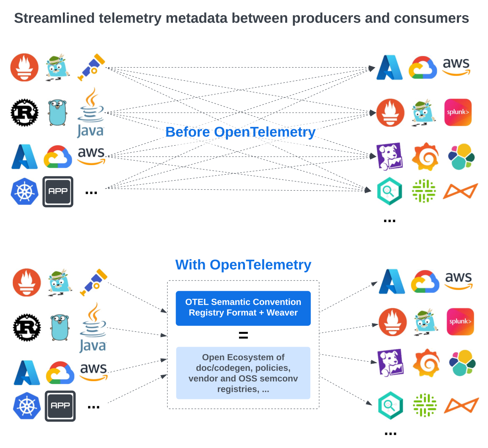

# OpenTelemetry Semantic Convention - Multi-Registry Proposal

Status: Work in Progress

## Introduction 

This document outlines the proposal to support multiple semantic convention registries in OpenTelemetry. The goal is
to enable the community to define and publish their own semantic conventions, which can be operated independently of the
core OpenTelemetry Semantic Conventions. This approach allows the community to define custom signals and attributes
specific to their domains or use cases while still leveraging the core signals and attributes defined by OpenTelemetry.

Multi-registries have the potential to significantly expand the OpenTelemetry ecosystem, enhancing flexibility
and extensibility. This will enable a wide range of use cases and scenarios. For example, vendors could publish
their own registries containing signals and attributes specific to their products, while open-source library authors could
define custom signals tailored to their libraries. Enterprises could also create internal registries to define custom
signals that align with their specific needs and share these across teams and products.

The effect of combining semantic conventions, multiple registries, and Weaver is illustrated in the diagram below.



This proposal outlines the changes required to support multiple semantic convention registries in OpenTelemetry, including
the core policies that all registries must adhere to, the format of published registries, and the modifications needed
in Weaver to support the creation, validation, generation, packaging, and publication of registries.

> [!NOTE]
> This proposal describes the overall changes required to achieve the multi-registry vision long term. However, these
> changes can be introduced incrementally. For example, we could start by supporting attributes only and gradually add
> support for metrics, events, spans, etc.

> [!NOTE]
> In this document, “semantic convention registry” refers to a collection of semantic convention entities (attributes,
> groups, signals, etc.) that define the semantics of the data model used in OpenTelemetry. The terms “registry” and
> “semantic convention registry” are used interchangeably. The term “entity” refers to any semantic convention
> attribute, group, or signal. The abbreviation “OTEL” refers to the OpenTelemetry project.

> [!NOTE]
> A very close concept to the multi-registry proposal was discussed in the past under the name of "Application
> Telemetry Schema". See the [Application Telemetry Schema Proposal](https://github.com/open-telemetry/oteps/blob/main/text/0243-app-telemetry-schema-vision-roadmap.md).

## Use Case Example

The following use case is not exhaustive but provides an example of the types of multi-registry scenarios we aim to
support.

The diagram below illustrates a small but realistic example of how multiple registries could be used together.
For more details, the YAML semantic convention files corresponding to the diagram are available in this
[folder](registries).


The color-coding within the signal descriptions indicates the provenance of the corresponding definition.

**Actors and Their Benefits** 

The multi-registry approach supports various actors, each benefiting differently from its flexibility and scalability.

1. **OTEL:**
  - **Value Proposition:**
    - OTEL can focus on defining core signals while delegating the creation of more specific signals
      to the community at scale.
    - OTEL establishes the foundation for developing new uses and tools in the observability ecosystem (e.g. data
      catalog integration, dashboard generation, database schema generation, metadata to improve AI assisted query
      engines, etc.). 

2. **Vendor:**
  - **Value Proposition:**
    - By publishing their own registry, vendors make it easier for their customers
      to discover and effectively use custom signals specific to their products.
    - Vendors can reuse common signals defined by OTEL, ensuring consistency in customer experiences. This
      strategy enhances the interoperability of their products within the larger observability ecosystem.

3. **OSS Library Author:**
  - **Value Proposition:**
    - OSS library authors can reuse OTEL-defined attributes and signals, integrating them with custom
      signals tailored to their library.
    - Publishing a registry for the library simplifies the integration process for
      developers, making it easier to adopt and use the library in a consistent and standardized way.
    - This approach also increases the attractiveness, visibility and usability of the library within
      the community.

4. **Enterprise Application:**
  - **Value Proposition:**
    - Enterprises can leverage the concept of registries to import external registries and simplify their observability
      integration for complex systems.
    - By creating internal registries, enterprises can define custom signals that align with their specific
      needs and share these across teams and products, fostering internal consistency. This capability enhances
      collaboration and streamlines the observability practices within the organization.

By supporting these actors and their specific use cases, the multi-registry approach enables a flexible,
community-driven model for defining and using semantic conventions across diverse domains and applications.

## Design Principles

- **Complexity on the system, not the user**: The system should handle the complexity of managing multiple registries,
  ensuring that users can easily create, validate, and publish registries without needing to understand the
  intricacies of the resolution process.
- **Independent Ownership**: Individuals or organizations should be able to create and maintain a registry
  independently, without requiring coordination with the OTEL project.
- **Core Policy Enforcement**: The OTEL project should establish and enforce core policies (e.g., backward
  compatibility) that all published registries must adhere to, ensuring consistency and reliability.
- **Registry Accessibility**: Registries should be either private or public, depending on the owner’s needs, 
  and accessible via a URL.
- **Cross-Registry References**: References between different registries should be supported to facilitate
  interoperability and integration across various registries.
- **Clear Rules to Avoid Conflicts**: A well-defined set of rules should be established and enforced to prevent
  conflicts among imported attributes and signals. Users are responsible for resolving any conflicts that cannot
  be automatically resolved by the tooling.
- **Circular Reference Handling**: Circular references between registries should be automatically detected,
  reported, and rejected to maintain system integrity and prevent conflicts.
- **Open Publication Format**: A published registry must adhere to a open format and packaging designed to ensure
  stability, ease of exchange, and consumption by other registries or tools.
- **Self-Contained**: A published registry should be self-contained to make the overall system more robust and
  resilient to changes in dependencies.
- **Version Discoverability**: Available versions of a published registry should be easily discoverable.
- **Transparency for Telemetry Consumers**: Downstream consumers of telemetry data (e.g., backends and dashboards)
  should never be exposed to conflicts within or between registries. They should see attributes and signals as
  defined, without scope or conflict resolution directives, ensuring a consistent and reliable data experience.
- **Community Support Tools**: The OTEL project should provide and maintain an extensible tool, Weaver, to
  assist the community in creating, validating, resolving, packaging, and publishing registries. Weaver should
  also support documentation and code generation for any published registry.
- **Clear, Actionable, and Educational Error Messages**: Weaver should detect and report any errors or inconsistencies
  in a registry, providing users with clear and actionable feedback.

## Semantic Convention Registry Changes

The following sections describe the changes needed in the semantic convention registry to support multiple registries.

### Directory Structure

The directory structure of a registry remains mostly unchanged, with the addition of a new file called
`weaver_registry.yaml`. This file contains the registry metadata, such as the name, version, and description.
It is required for published registries or registries with dependencies on other registries.

```plaintext
registry_root/
  domain_1/
  domain_2/
  ...
  resources/
  weaver_registry.yaml
```

### `weaver_registry.yaml` File

This file is used to describe the registry and its dependencies. It is optional for standalone registries
but required for published registries or registries with dependencies on other registries.

```yaml
name: <registry_name>
description: <registry_description>
version: <registry_version>
schema_url: <url_of_the_otel_schema_file_published_with_this_registry>
owner:
  name: <company_name_or_person_name>
  url: <optional_url_representing_the_owner>
maintainers:
  - name: <name>
    email: <optional email>
    url: <optional url>
dependencies:
  - name: <registry_name>
    version: <registry_version | latest>
    repository: <url_of_repository_where_registry_versions_are_published>
    alias: <optional alias>
configuration:
  allow_experimental_ref: <true|false>  # default value to be discussed
```

A registry can import one or more semantic conventions from other published registries. These dependencies
are declared in the `dependencies` section. The `alias` field is optional but must be specified
if multiple imported registries share the same `name`. 

Based on the `dependencies` section, Weaver can automatically update dependencies to the latest version when a new
version becomes available (see the [Registry Update](#registry-update) section). It also allows registry authors to use
registry names as preferred, without concerns about conflicts.

Sections such as [Registry Resolution](#registry-resolution), [Registry Packaging](#registry-packaging), and 
[Registry Publication](#registry-publication) provide more details on how the `weaver_registry.yaml` file
is used in these processes.

Open Questions:
- Should we follow SemVer 2 for registry versions? It seems advisable, as Weaver can detect breaking changes. However,
  the resolution process doesn't rely on SemVer 2 in an important way.
- How do we retrieve a published registry URL from a schema URL? Perhaps a new field in the schema URL file could
  point to the published registry URL, possibly named `registry_url`.

### Semantic Convention File Structure

The current [JSON Schema](https://github.com/open-telemetry/weaver/blob/main/schemas/semconv.schema.json) that
describes the files of the semantic convention registry remains mostly unchanged. However, a few minor updates are
required:

- The ability to reference a group must be supported, allowing a registry to extend or override fields of an
  imported group.
- The structure of a reference must be enhanced to disambiguate attribute or signal references from other registries
  when necessary (more details in the [Registry Resolution](#registry-resolution) section).

Currently, a reference follows dot notation (e.g., `ref: client.address`). When there is no ambiguity or conflict
detected by Weaver, this notation is sufficient. However, when a conflict occurs, the user must disambiguate the
reference by prefixing it with the registry name (e.g., `ref: otel:client.address`). The prefix corresponds
to the registry name as defined in the `weaver_registry.yaml` file under the `dependencies` section. A colon is used
as a separator between the name and the attribute or group name. References to groups or attributes defined in the
local registry are never prefixed.

In a group, the `extends` section can now reference an imported group using this new reference syntax. Similarly, the
`attributes` section of a group can reference an imported attribute.

In the current semantic conventions specification, referencing a group is currently unsupported. Uniqueness within
groups is scoped by the type of group. It is entirely possible to have an event and a metric identified by the same ID.
Therefore, the following approach is proposed to reference a group:

```yaml
groups:
  - metric_ref: <reference_to_a_metric_group>
  - event_ref: <reference_to_an_event_group>
  - span_ref: <reference_to_a_span_group>
  - ...
```

Similar to attribute references, group references cannot override the type, stability, or deprecation status of the
imported group.

References to experimental entities across registries are allowed under certain conditions:

- An entity referencing an experimental entity must also be marked as experimental.
- The flag `allow_experimental_ref` in the `weaver_registry.yaml` file must be set to `true`.

### Registry Resolution

The registry resolution process needs to handle more complex scenarios, especially when dealing with multiple
registries. It begins by parsing the `weaver_registry.yaml` file of the registry being resolved. All registries listed
under `dependencies` are loaded, parsed, and passed to the conflict resolution stage (assuming that any published
registries have already completed their resolution process). The dependencies of registries form a directed acyclic
graph. Each registry may be maintained by different owners and have different release schedules, which can introduce
conflicts, particularly when dependencies import different versions of a common ancestor or independently override
entities defined in the same ancestor registry.

The resolution process is designed to automatically detect and resolve most conflicts without user intervention.
However, when a conflict cannot be resolved consistently and predictably, the user must disambiguate by explicitly
choosing the imported registry to resolve the conflict.

The process hinges on the concept of mergeable entities (attributes or groups). For two entities to be considered
mergeable, they must, at least, meet the following basic criteria:
1. Both entities must be of the same type (e.g., attribute, metric, event, span, etc.).
2. They must share the same ID.
3. They must have a common ancestor (i.e., both were originally defined in the same registry).

Since entities are complex objects consisting of multiple fields, and override mechanisms are allowed, one of the
following additional conditions must be met:
- **Structural equivalence**: If the two entities have identical fields (i.e., both field names and values match), they
  are considered structurally equivalent and will be automatically deduplicated.
- **Version compatibility**: If the two entities have not been overridden in any intermediate registry but come from
  different versions of the same registry, the entity from the most recent version is used.
- **Disjoint overrides**: If the two entities have been overridden in intermediate registries but only in disjoint
  fields (i.e., no overlapping fields are overridden), the entities are automatically merged.

If none of these conditions are met, the user must resolve the conflict by explicitly prefixing the reference with the
appropriate registry name.

A formal definition of this resolution process is being developed, possibly based on Quint.

Two entities with the same type (e.g., attribute) and ID, defined in separate dependencies,
are not considered mergeable even if they are structurally equivalent. This is because these entities originate from
different registries without coordination, meaning their similarity is likely coincidental. While it would be
technically possible to merge them automatically, this is not currently allowed for safety.
If automatic merging becomes a common request, a specific configuration option in the
`weaver_registry.yaml` file could enable this behavior.

The detection mechanism for circular dependencies must be expanded to identify circular dependencies
between registries.

Weaver must be able to detect and report conflicts, circular dependencies, and other related issues with clear and
actionable error messages. These messages will heavily rely on the provenance information maintained by Weaver
throughout the resolution process of each registry. This ensures the user gains a clear understanding of the origin of
the conflict and the steps needed to resolve it.

Additionally, Weaver must support a flag to enable, on-demand, a verbose mode that explains the resolution process. This
will allow users to understand when and why entities are deduplicated, merged, or overridden.

Finally, the resolution process must be capable of generating an OTEL schema file that includes the URL of the published
registry, along with all transformation rules, both local and derived from imported registries. This allows consumers of
the published registry to navigate across different versions of the registry, accommodating components of the
observability stack that may not be aligned in terms of versioning.

> [!NOTE]
> The resolution process outlined above relies on specific requirements for published registries. The self-contained
> format of these registries must include the necessary provenance information to determine: 1) the common ancestor of
> two entities, and 2) versioning details.

> [!IMPORTANT]
> Telemetry consumers (i.e., anyone or anything downstream from signal production, such as backends, dashboards, users, etc.) 
> will observe the signals and attributes by their name, not by their optional prefix used for disambiguation. Other
> metadata and provenance information can also be consulted.

### Registry Check

The Weaver registry check command will be extended to apply the following mandatory policies when used in the context
of registry packaging:

- Having a dependency on a published registry and not using it is considered an error at the time of packaging.
- Any packaged registry must comply with the OTEL core policies to ensure backward compatibility and consistency
  across registries (see [Core Policies](#core-policies)).

[Probably more TBD here]

### Registry Packaging

Before publication, a registry must be packaged into a self-contained file that is easy to reference, download, and
consume. The packaging process is responsible for:
- Running the resolution process to ensure the registry is resolvable.
- Running OTEL core policies to ensure compatibility and consistency.
- Running user-defined policies to ensure compliance with custom rules.
- Serializing the resolved registry into a single file (exact format TBD). This file is self-contained and does not
  contain complex constructs like `ref`, `extends`, etc. However, the provenance of the entities/fields is included
  to support the multi-registry resolution process described earlier.
- Creating a compressed file containing the resolved registry and the `weaver_registry.yaml` file. The registry package
  is named `<name>-<version>.gz`.

The provenance information must include the name, version, and URL of the registry where the entity is
defined.

Open Questions:
- Should the OTEL Schema URL corresponding to the packaged registry be included in the package?

### Registry Publication

A published registry is a self-contained, resolved registry accessible via a URL. The URL of a published registry is
`<repository>/<name>-<version>.gz`. The repository is the URL where registry versions are published. The latest version
of a registry is also accessible via `<repository>/<name>-latest.gz`.

Weaver can maintain a directory containing all published versions of a registry. In that case, the `<name>-<version>.gz`
file and the `<name>-latest.gz` file are automatically stored in the directory.

### Registry Update

For any published registry, Weaver can discover the latest version by fetching the file located at
`<repository>/<name>-latest.gz` and parsing the `weaver_registry.yaml` file. This mechanism allows Weaver to
automatically suggest the latest version of dependencies.

## Resolved Semantic Convention Registry Format

The purpose of the resolved registry format is to provide a self-contained, easy-to-consume file containing all the
entities of a registry. This format excludes complex constructs such as `ref` or `extends` and is defined in a single
file. These properties make it easy for any tool — not just Weaver — to publish and consume it. This shift is key
to fostering a rich ecosystem around Semantic Conventions and OpenTelemetry. By removing complex constructs,
the format becomes more stable and less prone to changes. Any new mechanisms introduced in the semantic convention
format (e.g., embedding or more complex inheritance) will not affect the resolved registry format as long as the
resolution process can transform the unresolved registry into a resolved one.

The file format for the resolved registry is still under discussion but will likely be in YAML or JSON to
ensure compatibility with a wide range of tools.

A resolved registry consists of the following components:
- An internal, self-contained catalog of deduplicated attribute definitions, ensuring attributes are not defined
  multiple times in the registry.
- An internal catalog of registry identifiers, represented as triples (registry name, version, URL).
- A list of resolved groups with their attributes, using internal references to the attribute catalog.
- Provenance information for each entity, linking it to the corresponding entry in the registry identifier catalog,
  where the entity is either defined or overridden.

This format is optimized to minimize the in-memory size of the resolved registry, as many attributes are expected to be
shared across multiple entities and registries.

Weaver provides an additional mechanism to transform the resolved registry format into a materialized version. This
materialized format is less optimized for size (i.e., no internal catalogs, with all attribute definitions fully
materialized in each entity) but more optimized for consumption by other tools. Weaver currently uses this process
before invoking the jq, template, and policy engines.

### Weaver Changes

Weaver currently supports the following workflows:

- **check**: Check or validate a registry for consistency and compliance with the core policies.
- **resolve**: Resolve a registry and generate a resolved registry YAML file.
- **generate**: Generate code or documentation from a registry.

To support multiple registries, the following new workflows are proposed:

- **search**: Search for a specific entity (attribute, group, etc.) in a registry or across multiple registries.
- **update**: Detect and update the latest versions of a registry’s dependencies.
- **package**: Package a registry or a set of registries into a single file.
- **publish**: Publish a registry to a folder.

The command `weaver registry generate` must allow the generation of referenced entities from
imported registries and optionally generate entities defined in these registries but not referenced in the
local registry. The `--templates` parameter must support git URLs so community-based templates (including the official
OTEL templates) can be reused for any registry.

Similarly, the `--policies` parameter must support git URLs so community-based policies (including those defined by
OTEL) can be applied to any registry.

### OTEL Semantic Convention JSON Schema Changes

The JSON Schema for specifying semantic convention groups must be updated to support group references. Additionally, 
the reference format should be extended to optionally allow a reference to be prefixed by a registry name (e.g.,
`otel:client.address`).

### OTEL Schema Changes

The OTEL schema file structure must be updated to either include the URL to a published registry or to include the
published registry itself. ([Decision TBD] I have a reference for the first option).

## Protocol Changes

No impact on OTLP and OTAP.

A `schema_url` field is already present at the resource and scope levels.

Ideally, any component of the observability pipeline should be able to fetch the published registry just by knowing the
schema URL of any resource or instrumentation scope.

## OTEL SDKs Changes

To leverage the multi-registry feature, users should be able to generate code from their custom registry and use it as a
replacement for the default OTEL registry.

A more advanced feature would be generating type-safe client SDKs exposing all the entities defined in the custom
registry. A proof of concept is available in Weaver for the Rust language.

Open Questions:

- Can we enforce the presence of the schema URL at the resource and instrumentation scope levels?
- How do we convey the schema URL to the SDKs? Could this be part of the codegen done by Weaver?

## Future Work

In addition to implementing the multi-registry feature in Weaver, the following future work is planned:

- Efforts to formalize the resolution process are ongoing, with the aim of ensuring the process is consistent and fully
  addresses all targeted use cases.
- Privacy and security concerns have not been fully addressed in this proposal. The fact that certain sensitive
  attributes are not imported into your application’s registry does not guarantee they won’t appear in your
  application’s telemetry, as they could be defined and generated by linked libraries. Additionally, the override
  process only affects downstream instrumentation. Introducing a new type of semantic convention file that allows
  end-users to define global overrides and redact directives could help address these concerns. This new file format
  could be used by client SDKs or intermediary proxies to filter or redact sensitive attributes.

# Appendices

## Appendix A - Core Policies

These core policies aim to ensure consistency and backward compatibility across registries.

### Group Policies

- No group ID collisions
- Only attribute groups are allowed in the attribute registry
- Ref attributes are not allowed in the attribute registry
- ID attributes are not allowed in groups outside of the attribute registry

### Attribute Policies
- No attribute name collisions
- Attributes cannot be removed
- Attributes cannot "degrade" in stability (e.g., stable -> experimental)
- Stable attributes cannot change type
- All attributes must be defined inside a semantic convention registry
- Attribute names must match the following regular expression: `^[a-z][a-z0-9]*([._][a-z0-9]+)*$`
- Attributes with prefixes are not allowed; attributes must be fully qualified

### Enum Member Policies
- Stable members cannot change stability
- Values cannot change
- IDs cannot be removed
- Enum IDs must match the following regular expression: `^[a-z][a-z0-9]*([._][a-z0-9]+)*$`

### Metrics
- No metric name collisions
- Metrics cannot be removed
- Metrics cannot "degrade" in stability (e.g., stable -> experimental)
- Stable metric units cannot change
- Stable metric instruments cannot change
- The set of required/recommended attributes must remain the same
- Metric names must match the following regular expression: `^[a-z][a-z0-9]*([._][a-z0-9]+)*$`

### Events
- No event name collisions
- Events cannot be removed
- Events cannot "degrade" in stability (e.g., stable -> experimental)
- The set of required/recommended attributes must remain the same
- Event names must match the following regular expression: `^[a-z][a-z0-9]*([._][a-z0-9]+)*$`

### Spans
- No span name collisions
- Spans cannot be removed
- Spans cannot "degrade" in stability (e.g., stable -> experimental)
- The set of required/recommended attributes must remain the same
- Span names must match the following regular expression: `^[a-z][a-z0-9]*([._][a-z0-9]+)*$`

Liudmila's feedback on the core policies (need to be discussed):
```
I think we need to come up with more nuanced rules. E.g.
- it's ok to change recommended attribute to required.
- it's ok to remove recommended (if you have good reasons not to populate recommended, this is your way to tell that
  you don't populate it)
- it's ok to change conditionally required to recommended or required (if condition is always true)
- it might be ok to promote opt-in to recommended or even required

maybe those rules are complex enough that we just want to start with a simple one that all required attributes should
stay required
```